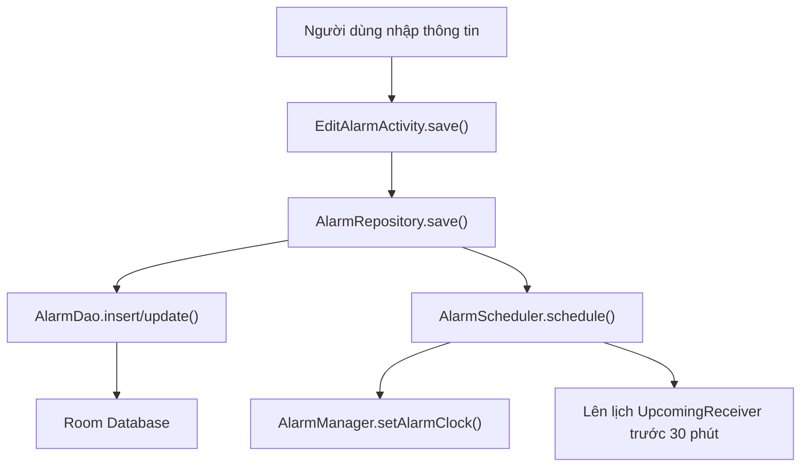
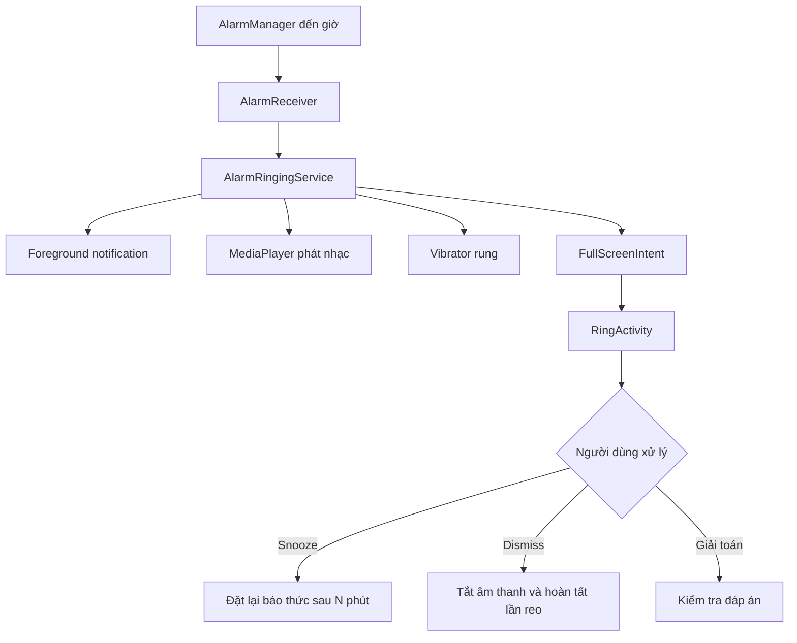

# Bản tổng hợp dự án Smart Alarm

## 1. Tổng quan

Smart Alarm là ứng dụng đồng hồ Android viết hoàn toàn bằng:

- Java cho xử lý logic.
- XML cho giao diện.
- Room Database để lưu báo thức.
- AlarmManager để hẹn giờ chính xác.
- BroadcastReceiver để nhận sự kiện báo thức.
- Foreground Service để phát nhạc và rung.
- Notification để hiện báo thức sắp tới, trạng thái snooze và màn hình báo thức.
- Material Design 3, hỗ trợ Light/Dark Mode.
- Hai ngôn ngữ: tiếng Việt và tiếng Anh.

Ứng dụng không cần Internet và không lấy dữ liệu từ server bên ngoài.

## 2. Các chức năng hiện có

| Chức năng | Trạng thái | Cơ chế |
|---|---:|---|
| Thêm, sửa, xóa báo thức | Có | Room + RecyclerView |
| Bật/tắt báo thức | Có | Cập nhật Room và AlarmManager |
| Lặp theo nhiều ngày | Có | Thứ 2 đến Chủ nhật hoặc Hằng ngày |
| Báo thức một lần | Có | Không chọn ngày lặp |
| Giữ báo thức một lần sau khi tắt | Có | `keepAfterDismiss` |
| Bỏ qua lần reo kế tiếp | Có | `skipUntilMillis` |
| Nhạc chuông mặc định | Có | `RingtoneManager` |
| Chọn nhạc trong máy | Có | `ACTION_OPEN_DOCUMENT` |
| Nghe thử nhạc | Có | `MediaPlayer` |
| Điều chỉnh âm lượng | Có | 0–100% |
| Tăng âm lượng dần | Có | Tăng trong khoảng 60 giây |
| Rung | Có | `Vibrator` |
| Snooze thủ công | Có | Thời gian 1–30 phút |
| Auto snooze | Có | Tự hoãn nếu không phản hồi |
| Auto dismiss | Có | Tự tắt nếu không phản hồi |
| Giải toán để tắt | Có | 3 mức độ |
| Quick alarm | Có | Tạo nhiều báo thức, hiển thị danh sách và xóa |
| Upcoming notification | Có | Hiện khi còn dưới 30 phút |
| Thông báo sau khi snooze | Có | Hiện thời gian sẽ reo lại |
| Timer | Có | 1–10.080 phút |
| Stopwatch | Có | Start, Pause, Resume, Reset |
| Stopwatch flag | Có | Lưu các mốc thời gian |
| Đồng hồ thế giới | Có | Danh sách cố định 10 thành phố |
| Việt/Anh | Có | `values` và `values-en` |
| Light/Dark/System | Có | Material DayNight |
| Màn hình reo trên màn hình khóa | Có | Full-screen notification + `RingActivity` |
| Reboot và đổi múi giờ | Có | Tự đặt lại báo thức |

---

# 3. Kiến trúc dự án

```text
com.example.samsung_alarm
│
├── SmartAlarmApp
│
├── data
│   ├── AppExecutors
│   ├── model
│   │   └── Alarm
│   ├── database
│   │   ├── AlarmDao
│   │   └── AppDatabase
│   └── repository
│       └── AlarmRepository
│
├── service
│   ├── AlarmScheduler
│   ├── AlarmReceiver
│   ├── AlarmRingingService
│   ├── NotificationHelper
│   ├── UpcomingNotificationManager
│   ├── UpcomingReceiver
│   └── BootReceiver
│
├── settings
│   └── AppPreferences
│
└── ui
    ├── common
    │   ├── LocalizedActivity
    │   └── SimpleSeekBarListener
    ├── edit
    │   └── EditAlarmActivity
    ├── main
    │   ├── MainActivity
    │   ├── AlarmAdapter
    │   ├── QuickAlarmAdapter
    │   ├── TimerController
    │   └── StopwatchController
    └── ring
        └── RingActivity
```

Ý nghĩa từng tầng:

- `ui`: Hiển thị giao diện và nhận thao tác người dùng.
- `repository`: Điều phối dữ liệu và việc đặt/hủy báo thức.
- `database`: Lưu dữ liệu lâu dài bằng Room.
- `service`: Chạy báo thức, notification, nhạc và rung.
- `settings`: Lưu ngôn ngữ và giao diện.
- `model`: Định nghĩa cấu trúc một báo thức.

---

# 4. Pipeline đặt và reo báo thức

## 4.1 Đặt báo thức



Quá trình:

1. Người dùng chọn giờ, ngày, âm thanh, âm lượng và cách tắt.
2. `EditAlarmActivity.save()` chuyển dữ liệu giao diện vào đối tượng `Alarm`.
3. `AlarmRepository.save()` lưu đối tượng xuống Room.
4. Repository gọi `AlarmScheduler.schedule()`.
5. Scheduler tính lần reo tiếp theo.
6. `AlarmManager` lưu thời điểm báo thức ở mức hệ điều hành.
7. Nếu báo thức còn dưới 30 phút, notification sắp tới được hiện ngay.
8. Nếu còn trên 30 phút, một `UpcomingReceiver` được lên lịch trước giờ reo 30 phút.

## 4.2 Khi đến giờ



`AlarmReceiver` không trực tiếp phát nhạc. Receiver khởi động `AlarmRingingService`, giúp báo thức tiếp tục hoạt động dù ứng dụng không mở.

## 4.3 Snooze

```text
RingActivity/Notification
        ↓
AlarmReceiver.ACTION_SNOOZE
        ↓
AlarmRingingService dừng nhạc
        ↓
AlarmRepository.snoozeSync()
        ↓
AlarmScheduler.scheduleSnooze()
        ↓
Notification “Đã hoãn đến HH:mm”
```

Khi đến thời gian snooze, cùng `AlarmReceiver` được gọi lại và quá trình reo bắt đầu lại.

---

# 5. Tầng dữ liệu

## `Alarm.java`

File: [Alarm.java](C:/Users/24hph/AndroidStudioProjects/samsung_alarm/app/src/main/java/com/example/samsung_alarm/data/model/Alarm.java)

Đây là Room Entity đại diện cho một báo thức.

Các nhóm thuộc tính:

- `id`: khóa chính tự tăng.
- `hour`, `minute`: giờ và phút.
- `isActive`: báo thức đang bật hay tắt.
- `mon` đến `sun`: ngày lặp.
- `label`: tên báo thức.
- `ringtoneUri`: đường dẫn nhạc chuông.
- `volume`: âm lượng 0–100.
- `isMathDismiss`: có cần giải toán không.
- `mathDifficulty`: mức độ bài toán.
- `snoozeMinutes`: số phút hoãn.
- `autoAction`: không xử lý, auto snooze hoặc auto dismiss.
- `autoAfterMinutes`: thời gian chờ trước khi tự xử lý.
- `keepAfterDismiss`: giữ lại báo thức một lần sau khi tắt.
- `skipUntilMillis`: bỏ qua lần lặp tiếp theo.
- `gradualVolume`: tăng âm lượng dần.
- `vibrate`: bật rung.
- `isQuickAlarm`: phân biệt quick alarm với báo thức thường.
- `triggerAtMillis`: thời gian tuyệt đối của quick alarm.

`repeats()` kiểm tra có ít nhất một ngày trong tuần được chọn hay không.

## `AlarmDao.java`

File: [AlarmDao.java](C:/Users/24hph/AndroidStudioProjects/samsung_alarm/app/src/main/java/com/example/samsung_alarm/data/database/AlarmDao.java)

Các hàm chính:

- `insert()`: thêm báo thức, trả về ID mới.
- `update()`: cập nhật báo thức.
- `delete()`: xóa báo thức.
- `getAllAlarms()`: trả về `LiveData`, UI tự cập nhật khi Room thay đổi.
- `getActiveAlarms()`: lấy các báo thức đang bật.
- `getById()`: tìm báo thức theo ID.
- `setActive()`: chỉ cập nhật trạng thái bật/tắt.

## `AppDatabase.java`

File: [AppDatabase.java](C:/Users/24hph/AndroidStudioProjects/samsung_alarm/app/src/main/java/com/example/samsung_alarm/data/database/AppDatabase.java)

- Sử dụng Singleton để toàn ứng dụng chỉ có một Room Database.
- Database hiện ở version 3.
- Migration 1→2 thêm các thuộc tính skip, gradual volume và vibrate.
- Migration 2→3 thêm quick alarm và thời gian reo tuyệt đối.
- Database lưu trong bộ nhớ riêng của ứng dụng với tên `alarm_database`.

## `AppExecutors.java`

Cung cấp một thread riêng cho thao tác database.

Room không nên được truy cập trên main thread vì có thể làm đứng giao diện. Tất cả insert, update, delete và truy vấn đồng bộ đều chạy qua executor này.

## `AlarmRepository.java`

File: [AlarmRepository.java](C:/Users/24hph/AndroidStudioProjects/samsung_alarm/app/src/main/java/com/example/samsung_alarm/data/repository/AlarmRepository.java)

Đây là lớp trung tâm nối UI, database và scheduler.

Các hàm quan trọng:

- `get()`: lấy Singleton repository.
- `observeAll()`: cung cấp danh sách báo thức dưới dạng `LiveData`.
- `getById()`: lấy một báo thức trên background thread.
- `save()`: thêm/cập nhật Room rồi đặt lại AlarmManager.
- `setActive()`: bật hoặc tắt báo thức.
- `disableSync()`: tắt báo thức từ notification.
- `delete()`: hủy PendingIntent rồi xóa khỏi Room.
- `toggleSkipNext()`: bỏ qua hoặc khôi phục lần lặp kế tiếp.
- `createQuickAlarm()`: tạo quick alarm dưới dạng một bản ghi Room độc lập.
- `snoozeSync()`: tính giờ snooze, đặt lại AlarmManager và hiện notification.
- `rescheduleAll()`: đặt lại tất cả báo thức sau reboot, đổi giờ hoặc cấp quyền.
- `finishOneTimeSync()`: xử lý báo thức một lần sau khi dismiss.
- `onTriggeredSync()`: dọn trạng thái skip và đặt lần reo tiếp theo cho báo thức lặp.

---

# 6. Scheduling, receiver và service

## `AlarmScheduler.java`

File: [AlarmScheduler.java](C:/Users/24hph/AndroidStudioProjects/samsung_alarm/app/src/main/java/com/example/samsung_alarm/service/AlarmScheduler.java)

Đây là lớp tính thời gian và giao tiếp với `AlarmManager`.

- `nextTrigger()`: trả về lần reo kế tiếp.
- `calculateNext()`: tính theo giờ, ngày lặp, quick alarm và skip.
- `enabled()`: kiểm tra một thứ trong tuần có được bật không.
- `canScheduleExact()`: kiểm tra quyền báo thức chính xác trên Android 12+.
- `exactAlarmPermissionIntent()`: mở màn hình cấp quyền.
- `schedule()`: đặt báo thức bằng `setAlarmClock()`.
- `scheduleSnooze()`: đặt lần reo sau khi snooze.
- `scheduleTimer()`: tạo báo thức tạm thời cho Timer.
- `cancel()`: hủy một báo thức.
- `cancelUpcoming()`: hủy notification sắp tới.
- `cancelTimer()`: hủy Timer trong AlarmManager.

`setAlarmClock()` được sử dụng vì đây là ứng dụng báo thức thực sự, cần hoạt động trong Doze và có độ chính xác cao.

## `AlarmReceiver.java`

File: [AlarmReceiver.java](C:/Users/24hph/AndroidStudioProjects/samsung_alarm/app/src/main/java/com/example/samsung_alarm/service/AlarmReceiver.java)

Nhận bốn loại sự kiện:

- Báo thức đến giờ.
- `ACTION_SNOOZE`.
- `ACTION_DISMISS`.
- `ACTION_DISABLE`.

Khi đến giờ, receiver:

1. Hủy notification sắp tới.
2. Khởi động foreground service.
3. Đặt lần reo tiếp theo nếu báo thức có lặp.

Khi snooze hoặc dismiss, receiver dừng service trước rồi cập nhật repository.

## `AlarmRingingService.java`

File: [AlarmRingingService.java](C:/Users/24hph/AndroidStudioProjects/samsung_alarm/app/src/main/java/com/example/samsung_alarm/service/AlarmRingingService.java)

Là thành phần thực sự phát báo thức.

- `onCreate()`: tạo notification channel.
- `onStartCommand()`: nhận ID và tải báo thức từ Room.
- `startRinging()`: tạo full-screen notification và bắt đầu phát.
- `play()`: chọn URI nhạc, âm lượng và chế độ rung.
- `startPlayer()`: cấu hình `MediaPlayer`, phát lặp.
- `startGradualVolume()`: tăng âm lượng từng bước trong 60 giây.
- `scheduleAutoAction()`: đặt auto snooze hoặc auto dismiss.
- `stopMedia()`: dừng và giải phóng MediaPlayer/Vibrator.
- `onDestroy()`: dọn toàn bộ callback.

Nếu file nhạc người dùng chọn không đọc được, service thử quay về nhạc báo thức mặc định.

Khi bật giải toán:

- Notification không cung cấp nút snooze/dismiss trực tiếp.
- Auto snooze và auto dismiss bị vô hiệu hóa.
- Người dùng phải vào `RingActivity` và giải đúng bài toán.

## `NotificationHelper.java`

Tạo hai notification channel:

- Kênh báo thức đang reo: mức ưu tiên cao.
- Kênh báo thức sắp tới: mức mặc định.

Âm thanh của notification bị tắt vì âm thanh do `AlarmRingingService` tự quản lý.

## `UpcomingNotificationManager.java`

Quản lý notification khi báo thức còn dưới 30 phút.

Notification:

- Hiển thị thời gian báo thức.
- Hiển thị tên báo thức.
- Luôn tồn tại đến khi báo thức reo.
- Có nút tắt báo thức ngay từ notification.
- Khi snooze, nội dung đổi thành “Đã hoãn đến …”.
- Tự hết hạn khi đến thời gian reo.

## `UpcomingReceiver.java`

Được AlarmManager gọi trước báo thức 30 phút. Receiver tải báo thức từ Room, kiểm tra còn active rồi yêu cầu `UpcomingNotificationManager` hiển thị notification.

## `BootReceiver.java`

Nhận:

- `BOOT_COMPLETED`.
- `TIME_SET`.
- `TIMEZONE_CHANGED`.

Sau đó gọi `rescheduleAll()` để khôi phục báo thức. Điều này cần thiết vì AlarmManager mất các lịch cũ sau khi thiết bị khởi động lại.

---

# 7. Giao diện chính

## `MainActivity.java`

File: [MainActivity.java](C:/Users/24hph/AndroidStudioProjects/samsung_alarm/app/src/main/java/com/example/samsung_alarm/ui/main/MainActivity.java)

MainActivity chứa năm màn chức năng trong cùng một Activity.

- `onCreate()`: khởi tạo repository, giao diện, danh sách, controller và xin quyền.
- `bindViews()`: ánh xạ các View XML vào biến Java.
- `setupAlarmList()`: tạo adapter và quan sát Room LiveData.
- `updateUpcoming()`: tìm báo thức có thời gian gần nhất.
- `setupNavigation()`: gắn sự kiện cho thanh điều hướng.
- `showPage()`: ẩn/hiện pane tương ứng với tab.
- `setupWorldClocks()`: tạo 10 dòng đồng hồ thế giới.
- `updateWorldClocks()`: cập nhật giờ, ngày và UTC offset.
- `utcOffset()`: chuyển offset múi giờ thành `UTC+07:00`.
- `setupQuick()`: cấu hình các nút quick alarm.
- `scheduleQuick()`: kiểm tra quyền rồi tạo quick alarm.
- `showSettings()`: dialog chọn theme và ngôn ngữ.
- `edit()`: mở màn sửa báo thức.
- `toggle()`: bật/tắt báo thức.
- `delete()`: hiện dialog xác nhận xóa.
- `skipNext()`: bỏ qua lần lặp kế tiếp.
- `ensureExactPermission()`: kiểm tra quyền exact alarm.
- `requestNotificationPermission()`: xin quyền notification Android 13+.
- `requestFullScreenPermissionIfNeeded()`: xin quyền full-screen trên Android 14+.
- `onResume()`: cập nhật đồng hồ thế giới và đặt lại báo thức khi vừa được cấp quyền.
- `onPause()`: dừng callback cập nhật giờ để tránh tốn tài nguyên.

## `AlarmAdapter.java`

File: [AlarmAdapter.java](C:/Users/24hph/AndroidStudioProjects/samsung_alarm/app/src/main/java/com/example/samsung_alarm/ui/main/AlarmAdapter.java)

Hiển thị danh sách báo thức thường.

Mỗi item gồm:

- Giờ.
- Nhãn.
- Ngày lặp.
- Thời gian còn lại.
- Switch bật/tắt.
- Nút skip.
- Nút xóa.

`remaining()` tính “Báo thức sau X giờ Y phút”. Adapter cập nhật mỗi giây nên dòng này thay đổi gần như realtime.

Khi báo thức tắt, phần nội dung được làm mờ nhưng switch và thùng rác vẫn giữ màu rõ ràng.

## `QuickAlarmAdapter.java`

Hiển thị đầy đủ tất cả quick alarm đang chờ.

Mỗi dòng gồm:

- Tên quick alarm.
- Giờ sẽ reo.
- Số phút còn lại.
- Nút xóa riêng.

Adapter cập nhật thời gian còn lại định kỳ và mỗi quick alarm là một bản ghi Room riêng, nên chúng không ghi đè lên nhau.

---

# 8. Màn chỉnh sửa báo thức

## `EditAlarmActivity.java`

File: [EditAlarmActivity.java](C:/Users/24hph/AndroidStudioProjects/samsung_alarm/app/src/main/java/com/example/samsung_alarm/ui/edit/EditAlarmActivity.java)

- `bind()`: ánh xạ toàn bộ control.
- `setup()`: cài listener, spinner, seek bar và các nút.
- `populate()`: đổ dữ liệu Alarm lên giao diện khi sửa.
- `setAllDays()`: chọn/bỏ chọn cả bảy ngày.
- `syncEveryDayButton()`: bật nút Hằng ngày nếu đủ bảy ngày.
- `pickRingtone()`: hiển thị danh sách nhạc hệ thống và lựa chọn file trong máy.
- `showRingtoneName()`: hiển thị tên file đã chọn.
- `displayName()`: đọc tên file từ ContentResolver.
- `togglePreview()`: phát hoặc dừng nghe thử.
- `stopPreview()`: giải phóng MediaPlayer nghe thử.
- `updateMathControls()`: ẩn snooze và auto action khi bật giải toán.
- `save()`: kiểm tra quyền, đọc dữ liệu UI, lưu Room và đặt báo thức.
- `onStop()`: dừng nhạc nghe thử khi rời Activity.

URI nhạc tự chọn được cấp quyền đọc lâu dài bằng `takePersistableUriPermission()`, do đó ứng dụng vẫn có thể đọc file sau khi mở lại.

---

# 9. Màn hình báo thức reo

## `RingActivity.java`

File: [RingActivity.java](C:/Users/24hph/AndroidStudioProjects/samsung_alarm/app/src/main/java/com/example/samsung_alarm/ui/ring/RingActivity.java)

Activity được cấu hình để:

- Hiện trên màn hình khóa.
- Bật sáng màn hình.
- Giữ màn hình sáng.
- Không cho nút Back đóng màn reo.
- Hiển thị toàn màn hình.
- Cập nhật giờ hiện tại mỗi phút.

Các hàm:

- `apply()`: đưa dữ liệu Alarm vào giao diện.
- `applyIntentPreview()`: hiển thị dữ liệu ngay từ Intent trong lúc Room chưa tải xong.
- `newProblem()`: sinh bài toán ngẫu nhiên.
- `dismiss()`: kiểm tra đáp án nếu cần rồi gửi lệnh tắt.
- `handleSwipe()`: xử lý thao tác vuốt lên.
- `resetSwipe()`: đưa nút vuốt về vị trí ban đầu.
- `setDismissEnabled()`: chỉ cho phép tắt khi dữ liệu đã sẵn sàng.
- `snooze()`: gửi lệnh snooze.
- `send()`: gửi broadcast và đóng task.
- `onResume()/onPause()`: bật hoặc dừng bộ cập nhật đồng hồ.

Mức toán:

- Dễ: cộng hoặc trừ.
- Trung bình: nhân.
- Khó: biểu thức hai phép tính dạng `a + b × c`.

Giao diện vuốt yêu cầu kéo lên khoảng 72% quãng đường mới được xem là thao tác tắt hợp lệ.

---

# 10. Timer

## `TimerController.java`

File: [TimerController.java](C:/Users/24hph/AndroidStudioProjects/samsung_alarm/app/src/main/java/com/example/samsung_alarm/ui/main/TimerController.java)

Timer cho phép:

- Kéo thanh từ 1–120 phút.
- Nhập tay từ 1–10.080 phút, tương đương bảy ngày.
- Start, Pause, Resume và Reset.
- Khi hết giờ vẫn gọi AlarmManager để reo dù người dùng rời app.

Các hàm:

- `toggle()`: start/pause/resume.
- `reset()`: hủy CountDownTimer và AlarmManager.
- `readInput()`: đọc và kiểm tra số phút.
- `setEditingEnabled()`: khóa input trong khi timer chạy.
- `format()`: hiển thị `MM:SS` hoặc `HH:MM:SS`.

`CountDownTimer` chỉ dùng để cập nhật giao diện. AlarmManager mới là thành phần đảm bảo báo thức Timer thực sự reo.

---

# 11. Stopwatch

## `StopwatchController.java`

File: [StopwatchController.java](C:/Users/24hph/AndroidStudioProjects/samsung_alarm/app/src/main/java/com/example/samsung_alarm/ui/main/StopwatchController.java)

- `toggle()`: bắt đầu, tạm dừng hoặc tiếp tục.
- `addFlag()`: lưu thời gian hiện tại thành một mốc.
- `reset()`: đưa thời gian về 0 và xóa toàn bộ flag.
- `format()`: định dạng `MM:SS.cc`.
- `tick`: cập nhật màn hình khoảng mỗi 30 ms.

`SystemClock.elapsedRealtime()` được dùng thay cho giờ hệ thống, nên stopwatch không bị sai khi người dùng thay đổi đồng hồ thiết bị.

---

# 12. Đồng hồ thế giới

Danh sách hiện có 10 thành phố:

1. TP. Hồ Chí Minh
2. Tokyo
3. Seoul
4. Singapore
5. Dubai
6. London
7. Paris
8. New York
9. Los Angeles
10. Sydney

Dữ liệu không đến từ API. Chương trình chỉ lưu `TimeZone ID`, tên thành phố và tên quốc gia cố định trong `MainActivity`.

Java `TimeZone` tự xử lý:

- Chênh lệch UTC.
- Múi giờ mùa hè.
- Ngày khác nhau giữa các quốc gia.

Danh sách được cập nhật ở đầu mỗi phút và dừng cập nhật khi Activity bị pause.

---

# 13. Ngôn ngữ, theme và UI

## Ngôn ngữ

- Tiếng Việt: [strings.xml](C:/Users/24hph/AndroidStudioProjects/samsung_alarm/app/src/main/res/values/strings.xml)
- Tiếng Anh: [strings.xml](C:/Users/24hph/AndroidStudioProjects/samsung_alarm/app/src/main/res/values-en/strings.xml)

`AppPreferences.language()` mặc định trả về `"vi"`, nên lần đầu mở app phải dùng tiếng Việt.

## Theme

- Theme sáng: [themes.xml](C:/Users/24hph/AndroidStudioProjects/samsung_alarm/app/src/main/res/values/themes.xml)
- Theme tối: [themes.xml](C:/Users/24hph/AndroidStudioProjects/samsung_alarm/app/src/main/res/values-night/themes.xml)

Có ba lựa chọn:

- Theo hệ thống.
- Sáng.
- Tối.

## `AppPreferences.java`

- `theme()`: đọc theme.
- `language()`: đọc ngôn ngữ.
- `localizedContext()`: tạo Context với locale đã chọn.
- `save()`: lưu lựa chọn bằng SharedPreferences.
- `apply()`: áp dụng AppCompat locale và DayNight mode.

## `SmartAlarmApp.java`

File: [SmartAlarmApp.java](C:/Users/24hph/AndroidStudioProjects/samsung_alarm/app/src/main/java/com/example/samsung_alarm/SmartAlarmApp.java)

- `attachBaseContext()`: áp dụng ngôn ngữ trước khi tạo UI.
- `onCreate()`: áp dụng theme và tạo notification channel.

## Dialog

Toàn bộ Material dialog sử dụng theme bo góc 28dp, gồm:

- Chọn nhạc chuông.
- Xác nhận xóa.
- Cài đặt ngôn ngữ/theme.
- Xin quyền full-screen alarm.

---

# 14. Dữ liệu được lấy và lưu ở đâu?

| Loại dữ liệu | Nguồn | Nơi lưu |
|---|---|---|
| Báo thức | Người dùng nhập | Room `alarm_database` |
| Quick alarm | Người dùng chọn phút | Room `alarm_database` |
| Nhạc hệ thống | `RingtoneManager` | Lưu URI trong Room |
| Nhạc tự chọn | Storage Access Framework | Lưu content URI trong Room |
| Theme/ngôn ngữ | Dialog Settings | SharedPreferences |
| Múi giờ thế giới | Java `TimeZone` | Danh sách cố định trong code |
| Timer | Người dùng nhập | Chỉ trong bộ nhớ + AlarmManager |
| Stopwatch/flag | Người dùng thao tác | Chỉ trong bộ nhớ |

---

# 15. Quyền Android cần thiết

File: [AndroidManifest.xml](C:/Users/24hph/AndroidStudioProjects/samsung_alarm/app/src/main/AndroidManifest.xml)

- `POST_NOTIFICATIONS`: hiển thị notification Android 13+.
- `SCHEDULE_EXACT_ALARM`: báo thức chính xác Android 12+.
- `USE_FULL_SCREEN_INTENT`: mở màn reo toàn màn hình.
- `FOREGROUND_SERVICE`: chạy service nền.
- `FOREGROUND_SERVICE_MEDIA_PLAYBACK`: service phát âm thanh.
- `RECEIVE_BOOT_COMPLETED`: khôi phục báo thức sau reboot.
- `WAKE_LOCK`: giữ CPU/màn hình hoạt động.
- `VIBRATE`: rung khi báo thức reo.

Trên Android 14+, quyền full-screen còn phải được người dùng cho phép trong Settings.

---

# 16. Các giới hạn hiện tại

1. Timer chưa lưu trạng thái vào Room. Nếu Activity hoặc process bị tạo lại, phần đếm trên UI có thể mất, dù AlarmManager đã đặt vẫn có thể reo.

2. Stopwatch và các flag chỉ nằm trong RAM. Đóng app hoặc Activity bị hủy sẽ mất dữ liệu.

3. Thời điểm snooze chưa được lưu thành một trường riêng trong Room. Nếu máy reboot trong lúc snooze, `BootReceiver` có thể đặt lại lịch báo thức gốc thay vì lịch snooze.

4. Đồng hồ thế giới chỉ có 10 thành phố cố định, chưa hỗ trợ thêm/xóa/tìm kiếm.

5. Timer dùng ID tạm `-1`. Màn reo có thể hiển thị nhãn “Quick alarm” thay vì “Timer” trong một số luồng.

6. Full-screen intent vẫn do Android quyết định. Khi máy đang mở khóa, hệ điều hành có thể chỉ hiển thị heads-up notification; khi khóa màn hình hoặc nhấn notification thì `RingActivity` được mở.

7. Báo thức được lưu trong vùng dữ liệu riêng của ứng dụng. Gỡ ứng dụng sẽ xóa database và cài đặt nếu không có backup.

Nhìn chung, dự án đã đáp ứng toàn bộ nhóm yêu cầu ban đầu: CRUD báo thức, nhạc và âm lượng, lặp nhiều ngày, keep/skip, upcoming notification, quick alarm, timer, stopwatch, auto snooze/dismiss, giải toán, đa ngôn ngữ, dark mode và màn reo toàn màn hình. Phần nên ưu tiên hoàn thiện tiếp theo là lưu bền trạng thái snooze, Timer và Stopwatch.
