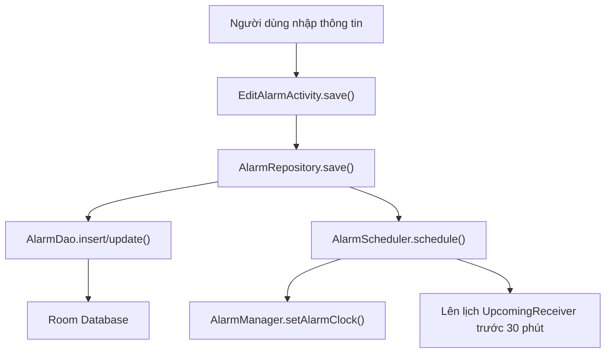
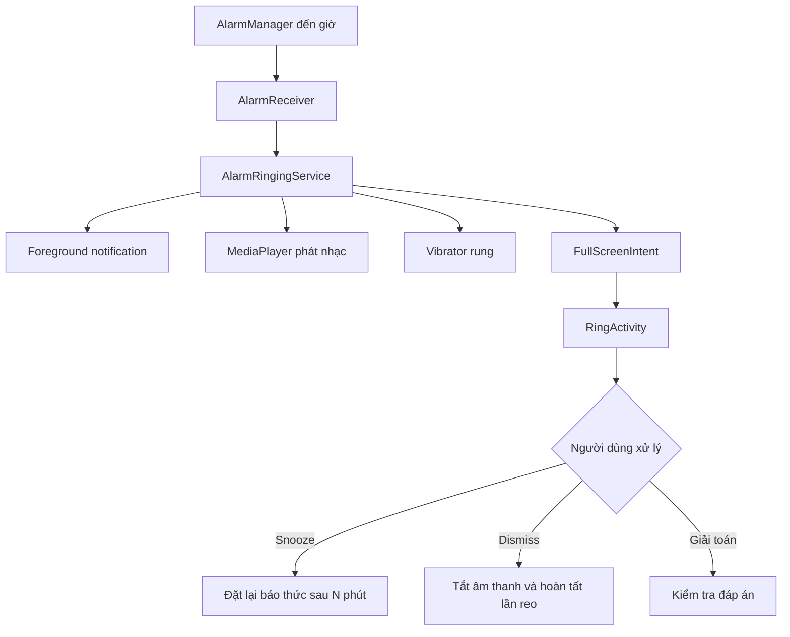
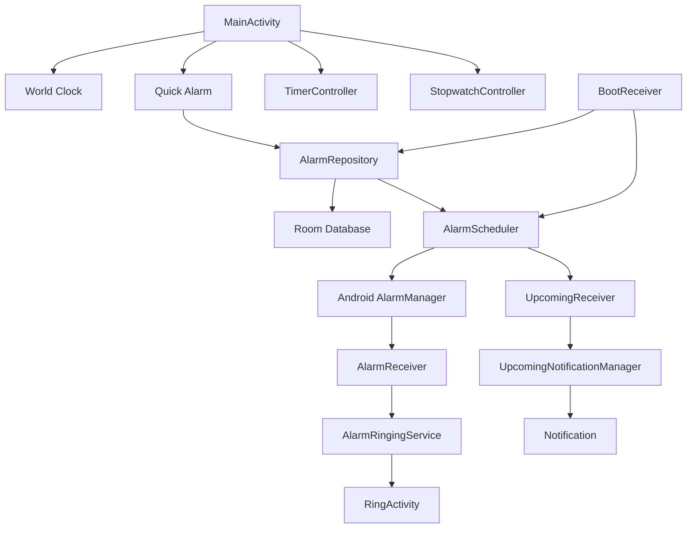
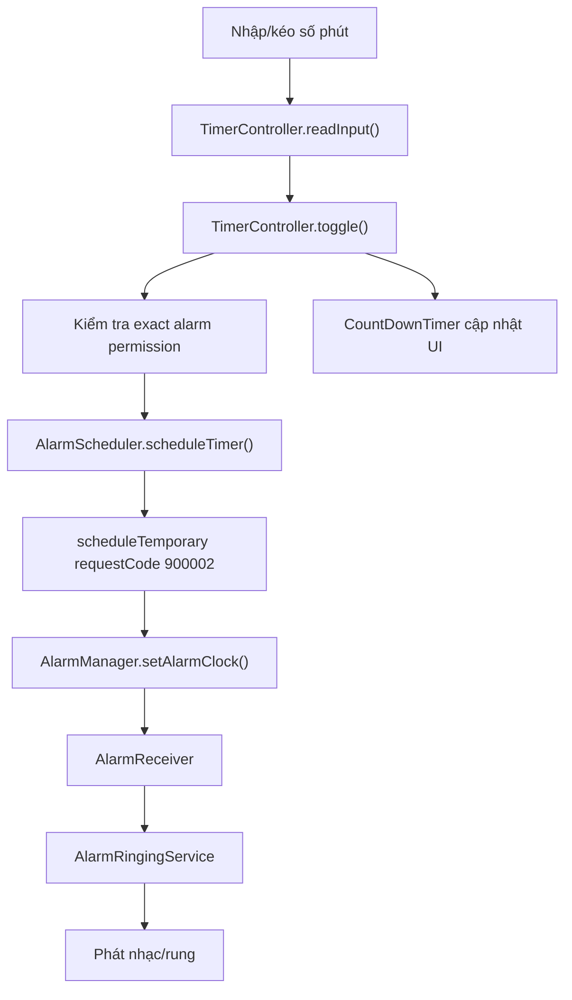
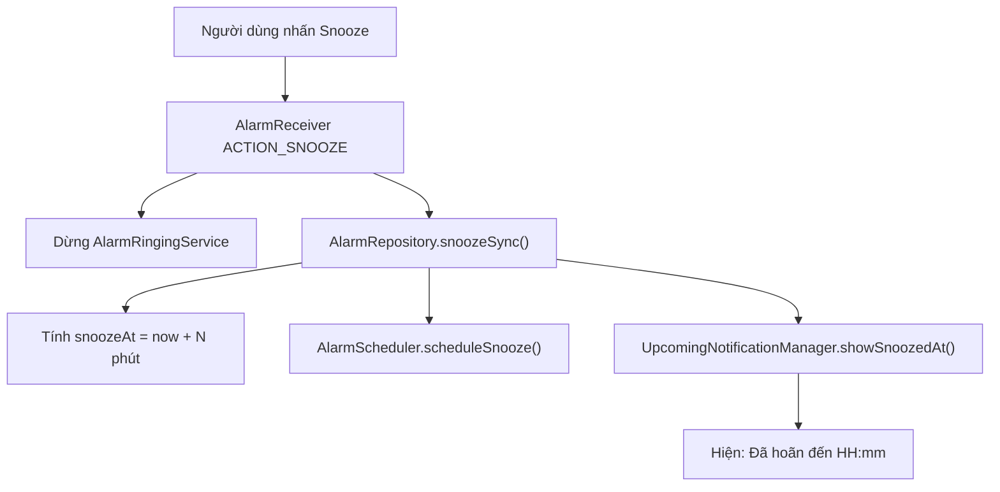

# Bản tổng hợp dự án Smart Alarm

## 1. Tổng quan

Smart Alarm là ứng dụng đồng hồ Android viết hoàn toàn bằng:

- Java cho xử lý logic.
- XML cho giao diện.
- Room Database để lưu báo thức.
- AlarmManager để hẹn giờ chính xác.
- BroadcastReceiver để nhận sự kiện báo thức.
- Foreground Service để phát nhạc và rung.
- Notification để hiện báo thức sắp tới, trạng thái snooze và màn hình báo thức.
- Material Design 3, hỗ trợ Light/Dark Mode.
- Hai ngôn ngữ: tiếng Việt và tiếng Anh.

Ứng dụng không cần Internet và không lấy dữ liệu từ server bên ngoài.

## 2. Các chức năng hiện có

| Chức năng | Trạng thái | Cơ chế |
|---|---:|---|
| Thêm, sửa, xóa báo thức | Có | Room + RecyclerView |
| Bật/tắt báo thức | Có | Cập nhật Room và AlarmManager |
| Lặp theo nhiều ngày | Có | Thứ 2 đến Chủ nhật hoặc Hằng ngày |
| Báo thức một lần | Có | Không chọn ngày lặp |
| Giữ báo thức một lần sau khi tắt | Có | `keepAfterDismiss` |
| Bỏ qua lần reo kế tiếp | Có | `skipUntilMillis` |
| Nhạc chuông mặc định | Có | `RingtoneManager` |
| Chọn nhạc trong máy | Có | `ACTION_OPEN_DOCUMENT` |
| Nghe thử nhạc | Có | `MediaPlayer` |
| Điều chỉnh âm lượng | Có | 0–100% |
| Tăng âm lượng dần | Có | Tăng trong khoảng 60 giây |
| Rung | Có | `Vibrator` |
| Snooze thủ công | Có | Thời gian 1–30 phút |
| Auto snooze | Có | Tự hoãn nếu không phản hồi |
| Auto dismiss | Có | Tự tắt nếu không phản hồi |
| Giải toán để tắt | Có | 3 mức độ |
| Quick alarm | Có | Tạo nhiều báo thức, hiển thị danh sách và xóa |
| Upcoming notification | Có | Hiện khi còn dưới 30 phút |
| Thông báo sau khi snooze | Có | Hiện thời gian sẽ reo lại |
| Timer | Có | 1–10.080 phút |
| Stopwatch | Có | Start, Pause, Resume, Reset |
| Stopwatch flag | Có | Lưu các mốc thời gian |
| Đồng hồ thế giới | Có | Danh sách cố định 10 thành phố |
| Việt/Anh | Có | `values` và `values-en` |
| Light/Dark/System | Có | Material DayNight |
| Màn hình reo trên màn hình khóa | Có | Full-screen notification + `RingActivity` |
| Reboot và đổi múi giờ | Có | Tự đặt lại báo thức |

---

# 3. Kiến trúc dự án

```text
com.example.samsung_alarm
│
├── SmartAlarmApp
│
├── data
│   ├── AppExecutors
│   ├── model
│   │   └── Alarm
│   ├── database
│   │   ├── AlarmDao
│   │   └── AppDatabase
│   └── repository
│       └── AlarmRepository
│
├── service
│   ├── AlarmScheduler
│   ├── AlarmReceiver
│   ├── AlarmRingingService
│   ├── NotificationHelper
│   ├── UpcomingNotificationManager
│   ├── UpcomingReceiver
│   └── BootReceiver
│
├── settings
│   └── AppPreferences
│
└── ui
    ├── common
    │   ├── LocalizedActivity
    │   └── SimpleSeekBarListener
    ├── edit
    │   └── EditAlarmActivity
    ├── main
    │   ├── MainActivity
    │   ├── AlarmAdapter
    │   ├── QuickAlarmAdapter
    │   ├── TimerController
    │   └── StopwatchController
    └── ring
        └── RingActivity
```

Ý nghĩa từng tầng:

- `ui`: Hiển thị giao diện và nhận thao tác người dùng.
- `repository`: Điều phối dữ liệu và việc đặt/hủy báo thức.
- `database`: Lưu dữ liệu lâu dài bằng Room.
- `service`: Chạy báo thức, notification, nhạc và rung.
- `settings`: Lưu ngôn ngữ và giao diện.
- `model`: Định nghĩa cấu trúc một báo thức.

---

# 4. Pipeline đặt và reo báo thức

## 4.1 Đặt báo thức



Quá trình:

1. Người dùng chọn giờ, ngày, âm thanh, âm lượng và cách tắt.
2. `EditAlarmActivity.save()` chuyển dữ liệu giao diện vào đối tượng `Alarm`.
3. `AlarmRepository.save()` lưu đối tượng xuống Room.
4. Repository gọi `AlarmScheduler.schedule()`.
5. Scheduler tính lần reo tiếp theo.
6. `AlarmManager` lưu thời điểm báo thức ở mức hệ điều hành.
7. Nếu báo thức còn dưới 30 phút, notification sắp tới được hiện ngay.
8. Nếu còn trên 30 phút, một `UpcomingReceiver` được lên lịch trước giờ reo 30 phút.

## 4.2 Khi đến giờ



`AlarmReceiver` không trực tiếp phát nhạc. Receiver khởi động `AlarmRingingService`, giúp báo thức tiếp tục hoạt động dù ứng dụng không mở.

## 4.3 Snooze

```text
RingActivity/Notification
        ↓
AlarmReceiver.ACTION_SNOOZE
        ↓
AlarmRingingService dừng nhạc
        ↓
AlarmRepository.snoozeSync()
        ↓
AlarmScheduler.scheduleSnooze()
        ↓
Notification “Đã hoãn đến HH:mm”
```

Khi đến thời gian snooze, cùng `AlarmReceiver` được gọi lại và quá trình reo bắt đầu lại.

---

# 5. Tầng dữ liệu

## `Alarm.java`

File: [Alarm.java](C:/Users/24hph/AndroidStudioProjects/samsung_alarm/app/src/main/java/com/example/samsung_alarm/data/model/Alarm.java)

Đây là Room Entity đại diện cho một báo thức.

Các nhóm thuộc tính:

- `id`: khóa chính tự tăng.
- `hour`, `minute`: giờ và phút.
- `isActive`: báo thức đang bật hay tắt.
- `mon` đến `sun`: ngày lặp.
- `label`: tên báo thức.
- `ringtoneUri`: đường dẫn nhạc chuông.
- `volume`: âm lượng 0–100.
- `isMathDismiss`: có cần giải toán không.
- `mathDifficulty`: mức độ bài toán.
- `snoozeMinutes`: số phút hoãn.
- `autoAction`: không xử lý, auto snooze hoặc auto dismiss.
- `autoAfterMinutes`: thời gian chờ trước khi tự xử lý.
- `keepAfterDismiss`: giữ lại báo thức một lần sau khi tắt.
- `skipUntilMillis`: bỏ qua lần lặp tiếp theo.
- `gradualVolume`: tăng âm lượng dần.
- `vibrate`: bật rung.
- `isQuickAlarm`: phân biệt quick alarm với báo thức thường.
- `triggerAtMillis`: thời gian tuyệt đối của quick alarm.

`repeats()` kiểm tra có ít nhất một ngày trong tuần được chọn hay không.

## `AlarmDao.java`

File: [AlarmDao.java](C:/Users/24hph/AndroidStudioProjects/samsung_alarm/app/src/main/java/com/example/samsung_alarm/data/database/AlarmDao.java)

Các hàm chính:

- `insert()`: thêm báo thức, trả về ID mới.
- `update()`: cập nhật báo thức.
- `delete()`: xóa báo thức.
- `getAllAlarms()`: trả về `LiveData`, UI tự cập nhật khi Room thay đổi.
- `getActiveAlarms()`: lấy các báo thức đang bật.
- `getById()`: tìm báo thức theo ID.
- `setActive()`: chỉ cập nhật trạng thái bật/tắt.

## `AppDatabase.java`

File: [AppDatabase.java](C:/Users/24hph/AndroidStudioProjects/samsung_alarm/app/src/main/java/com/example/samsung_alarm/data/database/AppDatabase.java)

- Sử dụng Singleton để toàn ứng dụng chỉ có một Room Database.
- Database hiện ở version 3.
- Migration 1→2 thêm các thuộc tính skip, gradual volume và vibrate.
- Migration 2→3 thêm quick alarm và thời gian reo tuyệt đối.
- Database lưu trong bộ nhớ riêng của ứng dụng với tên `alarm_database`.

## `AppExecutors.java`

Cung cấp một thread riêng cho thao tác database.

Room không nên được truy cập trên main thread vì có thể làm đứng giao diện. Tất cả insert, update, delete và truy vấn đồng bộ đều chạy qua executor này.

## `AlarmRepository.java`

File: [AlarmRepository.java](C:/Users/24hph/AndroidStudioProjects/samsung_alarm/app/src/main/java/com/example/samsung_alarm/data/repository/AlarmRepository.java)

Đây là lớp trung tâm nối UI, database và scheduler.

Các hàm quan trọng:

- `get()`: lấy Singleton repository.
- `observeAll()`: cung cấp danh sách báo thức dưới dạng `LiveData`.
- `getById()`: lấy một báo thức trên background thread.
- `save()`: thêm/cập nhật Room rồi đặt lại AlarmManager.
- `setActive()`: bật hoặc tắt báo thức.
- `disableSync()`: tắt báo thức từ notification.
- `delete()`: hủy PendingIntent rồi xóa khỏi Room.
- `toggleSkipNext()`: bỏ qua hoặc khôi phục lần lặp kế tiếp.
- `createQuickAlarm()`: tạo quick alarm dưới dạng một bản ghi Room độc lập.
- `snoozeSync()`: tính giờ snooze, đặt lại AlarmManager và hiện notification.
- `rescheduleAll()`: đặt lại tất cả báo thức sau reboot, đổi giờ hoặc cấp quyền.
- `finishOneTimeSync()`: xử lý báo thức một lần sau khi dismiss.
- `onTriggeredSync()`: dọn trạng thái skip và đặt lần reo tiếp theo cho báo thức lặp.

---

# 6. Scheduling, receiver và service

## `AlarmScheduler.java`

File: [AlarmScheduler.java](C:/Users/24hph/AndroidStudioProjects/samsung_alarm/app/src/main/java/com/example/samsung_alarm/service/AlarmScheduler.java)

Đây là lớp tính thời gian và giao tiếp với `AlarmManager`.

- `nextTrigger()`: trả về lần reo kế tiếp.
- `calculateNext()`: tính theo giờ, ngày lặp, quick alarm và skip.
- `enabled()`: kiểm tra một thứ trong tuần có được bật không.
- `canScheduleExact()`: kiểm tra quyền báo thức chính xác trên Android 12+.
- `exactAlarmPermissionIntent()`: mở màn hình cấp quyền.
- `schedule()`: đặt báo thức bằng `setAlarmClock()`.
- `scheduleSnooze()`: đặt lần reo sau khi snooze.
- `scheduleTimer()`: tạo báo thức tạm thời cho Timer.
- `cancel()`: hủy một báo thức.
- `cancelUpcoming()`: hủy notification sắp tới.
- `cancelTimer()`: hủy Timer trong AlarmManager.

`setAlarmClock()` được sử dụng vì đây là ứng dụng báo thức thực sự, cần hoạt động trong Doze và có độ chính xác cao.

## `AlarmReceiver.java`

File: [AlarmReceiver.java](C:/Users/24hph/AndroidStudioProjects/samsung_alarm/app/src/main/java/com/example/samsung_alarm/service/AlarmReceiver.java)

Nhận bốn loại sự kiện:

- Báo thức đến giờ.
- `ACTION_SNOOZE`.
- `ACTION_DISMISS`.
- `ACTION_DISABLE`.

Khi đến giờ, receiver:

1. Hủy notification sắp tới.
2. Khởi động foreground service.
3. Đặt lần reo tiếp theo nếu báo thức có lặp.

Khi snooze hoặc dismiss, receiver dừng service trước rồi cập nhật repository.

## `AlarmRingingService.java`

File: [AlarmRingingService.java](C:/Users/24hph/AndroidStudioProjects/samsung_alarm/app/src/main/java/com/example/samsung_alarm/service/AlarmRingingService.java)

Là thành phần thực sự phát báo thức.

- `onCreate()`: tạo notification channel.
- `onStartCommand()`: nhận ID và tải báo thức từ Room.
- `startRinging()`: tạo full-screen notification và bắt đầu phát.
- `play()`: chọn URI nhạc, âm lượng và chế độ rung.
- `startPlayer()`: cấu hình `MediaPlayer`, phát lặp.
- `startGradualVolume()`: tăng âm lượng từng bước trong 60 giây.
- `scheduleAutoAction()`: đặt auto snooze hoặc auto dismiss.
- `stopMedia()`: dừng và giải phóng MediaPlayer/Vibrator.
- `onDestroy()`: dọn toàn bộ callback.

Nếu file nhạc người dùng chọn không đọc được, service thử quay về nhạc báo thức mặc định.

Khi bật giải toán:

- Notification không cung cấp nút snooze/dismiss trực tiếp.
- Auto snooze và auto dismiss bị vô hiệu hóa.
- Người dùng phải vào `RingActivity` và giải đúng bài toán.

## `NotificationHelper.java`

Tạo hai notification channel:

- Kênh báo thức đang reo: mức ưu tiên cao.
- Kênh báo thức sắp tới: mức mặc định.

Âm thanh của notification bị tắt vì âm thanh do `AlarmRingingService` tự quản lý.

## `UpcomingNotificationManager.java`

Quản lý notification khi báo thức còn dưới 30 phút.

Notification:

- Hiển thị thời gian báo thức.
- Hiển thị tên báo thức.
- Luôn tồn tại đến khi báo thức reo.
- Có nút tắt báo thức ngay từ notification.
- Khi snooze, nội dung đổi thành “Đã hoãn đến …”.
- Tự hết hạn khi đến thời gian reo.

## `UpcomingReceiver.java`

Được AlarmManager gọi trước báo thức 30 phút. Receiver tải báo thức từ Room, kiểm tra còn active rồi yêu cầu `UpcomingNotificationManager` hiển thị notification.

## `BootReceiver.java`

Nhận:

- `BOOT_COMPLETED`.
- `TIME_SET`.
- `TIMEZONE_CHANGED`.

Sau đó gọi `rescheduleAll()` để khôi phục báo thức. Điều này cần thiết vì AlarmManager mất các lịch cũ sau khi thiết bị khởi động lại.

---

# 7. Giao diện chính

## `MainActivity.java`

File: [MainActivity.java](C:/Users/24hph/AndroidStudioProjects/samsung_alarm/app/src/main/java/com/example/samsung_alarm/ui/main/MainActivity.java)

MainActivity chứa năm màn chức năng trong cùng một Activity.

- `onCreate()`: khởi tạo repository, giao diện, danh sách, controller và xin quyền.
- `bindViews()`: ánh xạ các View XML vào biến Java.
- `setupAlarmList()`: tạo adapter và quan sát Room LiveData.
- `updateUpcoming()`: tìm báo thức có thời gian gần nhất.
- `setupNavigation()`: gắn sự kiện cho thanh điều hướng.
- `showPage()`: ẩn/hiện pane tương ứng với tab.
- `setupWorldClocks()`: tạo 10 dòng đồng hồ thế giới.
- `updateWorldClocks()`: cập nhật giờ, ngày và UTC offset.
- `utcOffset()`: chuyển offset múi giờ thành `UTC+07:00`.
- `setupQuick()`: cấu hình các nút quick alarm.
- `scheduleQuick()`: kiểm tra quyền rồi tạo quick alarm.
- `showSettings()`: dialog chọn theme và ngôn ngữ.
- `edit()`: mở màn sửa báo thức.
- `toggle()`: bật/tắt báo thức.
- `delete()`: hiện dialog xác nhận xóa.
- `skipNext()`: bỏ qua lần lặp kế tiếp.
- `ensureExactPermission()`: kiểm tra quyền exact alarm.
- `requestNotificationPermission()`: xin quyền notification Android 13+.
- `requestFullScreenPermissionIfNeeded()`: xin quyền full-screen trên Android 14+.
- `onResume()`: cập nhật đồng hồ thế giới và đặt lại báo thức khi vừa được cấp quyền.
- `onPause()`: dừng callback cập nhật giờ để tránh tốn tài nguyên.

## `AlarmAdapter.java`

File: [AlarmAdapter.java](C:/Users/24hph/AndroidStudioProjects/samsung_alarm/app/src/main/java/com/example/samsung_alarm/ui/main/AlarmAdapter.java)

Hiển thị danh sách báo thức thường.

Mỗi item gồm:

- Giờ.
- Nhãn.
- Ngày lặp.
- Thời gian còn lại.
- Switch bật/tắt.
- Nút skip.
- Nút xóa.

`remaining()` tính “Báo thức sau X giờ Y phút”. Adapter cập nhật mỗi giây nên dòng này thay đổi gần như realtime.

Khi báo thức tắt, phần nội dung được làm mờ nhưng switch và thùng rác vẫn giữ màu rõ ràng.

## `QuickAlarmAdapter.java`

Hiển thị đầy đủ tất cả quick alarm đang chờ.

Mỗi dòng gồm:

- Tên quick alarm.
- Giờ sẽ reo.
- Số phút còn lại.
- Nút xóa riêng.

Adapter cập nhật thời gian còn lại định kỳ và mỗi quick alarm là một bản ghi Room riêng, nên chúng không ghi đè lên nhau.

---

# 8. Màn chỉnh sửa báo thức

## `EditAlarmActivity.java`

File: [EditAlarmActivity.java](C:/Users/24hph/AndroidStudioProjects/samsung_alarm/app/src/main/java/com/example/samsung_alarm/ui/edit/EditAlarmActivity.java)

- `bind()`: ánh xạ toàn bộ control.
- `setup()`: cài listener, spinner, seek bar và các nút.
- `populate()`: đổ dữ liệu Alarm lên giao diện khi sửa.
- `setAllDays()`: chọn/bỏ chọn cả bảy ngày.
- `syncEveryDayButton()`: bật nút Hằng ngày nếu đủ bảy ngày.
- `pickRingtone()`: hiển thị danh sách nhạc hệ thống và lựa chọn file trong máy.
- `showRingtoneName()`: hiển thị tên file đã chọn.
- `displayName()`: đọc tên file từ ContentResolver.
- `togglePreview()`: phát hoặc dừng nghe thử.
- `stopPreview()`: giải phóng MediaPlayer nghe thử.
- `updateMathControls()`: ẩn snooze và auto action khi bật giải toán.
- `save()`: kiểm tra quyền, đọc dữ liệu UI, lưu Room và đặt báo thức.
- `onStop()`: dừng nhạc nghe thử khi rời Activity.

URI nhạc tự chọn được cấp quyền đọc lâu dài bằng `takePersistableUriPermission()`, do đó ứng dụng vẫn có thể đọc file sau khi mở lại.

---

# 9. Màn hình báo thức reo

## `RingActivity.java`

File: [RingActivity.java](C:/Users/24hph/AndroidStudioProjects/samsung_alarm/app/src/main/java/com/example/samsung_alarm/ui/ring/RingActivity.java)

Activity được cấu hình để:

- Hiện trên màn hình khóa.
- Bật sáng màn hình.
- Giữ màn hình sáng.
- Không cho nút Back đóng màn reo.
- Hiển thị toàn màn hình.
- Cập nhật giờ hiện tại mỗi phút.

Các hàm:

- `apply()`: đưa dữ liệu Alarm vào giao diện.
- `applyIntentPreview()`: hiển thị dữ liệu ngay từ Intent trong lúc Room chưa tải xong.
- `newProblem()`: sinh bài toán ngẫu nhiên.
- `dismiss()`: kiểm tra đáp án nếu cần rồi gửi lệnh tắt.
- `handleSwipe()`: xử lý thao tác vuốt lên.
- `resetSwipe()`: đưa nút vuốt về vị trí ban đầu.
- `setDismissEnabled()`: chỉ cho phép tắt khi dữ liệu đã sẵn sàng.
- `snooze()`: gửi lệnh snooze.
- `send()`: gửi broadcast và đóng task.
- `onResume()/onPause()`: bật hoặc dừng bộ cập nhật đồng hồ.

Mức toán:

- Dễ: cộng hoặc trừ.
- Trung bình: nhân.
- Khó: biểu thức hai phép tính dạng `a + b × c`.

Giao diện vuốt yêu cầu kéo lên khoảng 72% quãng đường mới được xem là thao tác tắt hợp lệ.

---

# 10. Timer

## `TimerController.java`

File: [TimerController.java](C:/Users/24hph/AndroidStudioProjects/samsung_alarm/app/src/main/java/com/example/samsung_alarm/ui/main/TimerController.java)

Timer cho phép:

- Kéo thanh từ 1–120 phút.
- Nhập tay từ 1–10.080 phút, tương đương bảy ngày.
- Start, Pause, Resume và Reset.
- Khi hết giờ vẫn gọi AlarmManager để reo dù người dùng rời app.

Các hàm:

- `toggle()`: start/pause/resume.
- `reset()`: hủy CountDownTimer và AlarmManager.
- `readInput()`: đọc và kiểm tra số phút.
- `setEditingEnabled()`: khóa input trong khi timer chạy.
- `format()`: hiển thị `MM:SS` hoặc `HH:MM:SS`.

`CountDownTimer` chỉ dùng để cập nhật giao diện. AlarmManager mới là thành phần đảm bảo báo thức Timer thực sự reo.

---

# 11. Stopwatch

## `StopwatchController.java`

File: [StopwatchController.java](C:/Users/24hph/AndroidStudioProjects/samsung_alarm/app/src/main/java/com/example/samsung_alarm/ui/main/StopwatchController.java)

- `toggle()`: bắt đầu, tạm dừng hoặc tiếp tục.
- `addFlag()`: lưu thời gian hiện tại thành một mốc.
- `reset()`: đưa thời gian về 0 và xóa toàn bộ flag.
- `format()`: định dạng `MM:SS.cc`.
- `tick`: cập nhật màn hình khoảng mỗi 30 ms.

`SystemClock.elapsedRealtime()` được dùng thay cho giờ hệ thống, nên stopwatch không bị sai khi người dùng thay đổi đồng hồ thiết bị.

---

# 12. Đồng hồ thế giới

Danh sách hiện có 10 thành phố:

1. TP. Hồ Chí Minh
2. Tokyo
3. Seoul
4. Singapore
5. Dubai
6. London
7. Paris
8. New York
9. Los Angeles
10. Sydney

Dữ liệu không đến từ API. Chương trình chỉ lưu `TimeZone ID`, tên thành phố và tên quốc gia cố định trong `MainActivity`.

Java `TimeZone` tự xử lý:

- Chênh lệch UTC.
- Múi giờ mùa hè.
- Ngày khác nhau giữa các quốc gia.

Danh sách được cập nhật ở đầu mỗi phút và dừng cập nhật khi Activity bị pause.

---

# 13. Ngôn ngữ, theme và UI

## Ngôn ngữ

- Tiếng Việt: [strings.xml](C:/Users/24hph/AndroidStudioProjects/samsung_alarm/app/src/main/res/values/strings.xml)
- Tiếng Anh: [strings.xml](C:/Users/24hph/AndroidStudioProjects/samsung_alarm/app/src/main/res/values-en/strings.xml)

`AppPreferences.language()` mặc định trả về `"vi"`, nên lần đầu mở app phải dùng tiếng Việt.

## Theme

- Theme sáng: [themes.xml](C:/Users/24hph/AndroidStudioProjects/samsung_alarm/app/src/main/res/values/themes.xml)
- Theme tối: [themes.xml](C:/Users/24hph/AndroidStudioProjects/samsung_alarm/app/src/main/res/values-night/themes.xml)

Có ba lựa chọn:

- Theo hệ thống.
- Sáng.
- Tối.

## `AppPreferences.java`

- `theme()`: đọc theme.
- `language()`: đọc ngôn ngữ.
- `localizedContext()`: tạo Context với locale đã chọn.
- `save()`: lưu lựa chọn bằng SharedPreferences.
- `apply()`: áp dụng AppCompat locale và DayNight mode.

## `SmartAlarmApp.java`

File: [SmartAlarmApp.java](C:/Users/24hph/AndroidStudioProjects/samsung_alarm/app/src/main/java/com/example/samsung_alarm/SmartAlarmApp.java)

- `attachBaseContext()`: áp dụng ngôn ngữ trước khi tạo UI.
- `onCreate()`: áp dụng theme và tạo notification channel.

## Dialog

Toàn bộ Material dialog sử dụng theme bo góc 28dp, gồm:

- Chọn nhạc chuông.
- Xác nhận xóa.
- Cài đặt ngôn ngữ/theme.
- Xin quyền full-screen alarm.

---

# 14. Dữ liệu được lấy và lưu ở đâu?

| Loại dữ liệu | Nguồn | Nơi lưu |
|---|---|---|
| Báo thức | Người dùng nhập | Room `alarm_database` |
| Quick alarm | Người dùng chọn phút | Room `alarm_database` |
| Nhạc hệ thống | `RingtoneManager` | Lưu URI trong Room |
| Nhạc tự chọn | Storage Access Framework | Lưu content URI trong Room |
| Theme/ngôn ngữ | Dialog Settings | SharedPreferences |
| Múi giờ thế giới | Java `TimeZone` | Danh sách cố định trong code |
| Timer | Người dùng nhập | Chỉ trong bộ nhớ + AlarmManager |
| Stopwatch/flag | Người dùng thao tác | Chỉ trong bộ nhớ |

---

# 15. Quyền Android cần thiết

File: [AndroidManifest.xml](C:/Users/24hph/AndroidStudioProjects/samsung_alarm/app/src/main/AndroidManifest.xml)

- `POST_NOTIFICATIONS`: hiển thị notification Android 13+.
- `SCHEDULE_EXACT_ALARM`: báo thức chính xác Android 12+.
- `USE_FULL_SCREEN_INTENT`: mở màn reo toàn màn hình.
- `FOREGROUND_SERVICE`: chạy service nền.
- `FOREGROUND_SERVICE_MEDIA_PLAYBACK`: service phát âm thanh.
- `RECEIVE_BOOT_COMPLETED`: khôi phục báo thức sau reboot.
- `WAKE_LOCK`: giữ CPU/màn hình hoạt động.
- `VIBRATE`: rung khi báo thức reo.

Trên Android 14+, quyền full-screen còn phải được người dùng cho phép trong Settings.

---

# 16. Các giới hạn hiện tại

1. Timer chưa lưu trạng thái vào Room. Nếu Activity hoặc process bị tạo lại, phần đếm trên UI có thể mất, dù AlarmManager đã đặt vẫn có thể reo.

2. Stopwatch và các flag chỉ nằm trong RAM. Đóng app hoặc Activity bị hủy sẽ mất dữ liệu.

3. Thời điểm snooze chưa được lưu thành một trường riêng trong Room. Nếu máy reboot trong lúc snooze, `BootReceiver` có thể đặt lại lịch báo thức gốc thay vì lịch snooze.

4. Đồng hồ thế giới chỉ có 10 thành phố cố định, chưa hỗ trợ thêm/xóa/tìm kiếm.

5. Timer dùng ID tạm `-1`. Màn reo có thể hiển thị nhãn “Quick alarm” thay vì “Timer” trong một số luồng.

6. Full-screen intent vẫn do Android quyết định. Khi máy đang mở khóa, hệ điều hành có thể chỉ hiển thị heads-up notification; khi khóa màn hình hoặc nhấn notification thì `RingActivity` được mở.

7. Báo thức được lưu trong vùng dữ liệu riêng của ứng dụng. Gỡ ứng dụng sẽ xóa database và cài đặt nếu không có backup.

Nhìn chung, dự án đã đáp ứng toàn bộ nhóm yêu cầu ban đầu: CRUD báo thức, nhạc và âm lượng, lặp nhiều ngày, keep/skip, upcoming notification, quick alarm, timer, stopwatch, auto snooze/dismiss, giải toán, đa ngôn ngữ, dark mode và màn reo toàn màn hình. Phần nên ưu tiên hoàn thiện tiếp theo là lưu bền trạng thái snooze, Timer và Stopwatch.


# Phần phụ trách của người 3

Theo phân chia hiện tại, phần của bạn gồm:

1. Giao diện Quick Alarm, Timer, Stopwatch và World Clock trong `activity_main.xml`.
2. `TimerController.java`.
3. `StopwatchController.java`.
4. Logic World Clock trong `MainActivity.java`.
5. Logic Quick Alarm trong `MainActivity.java`.
6. `QuickAlarmAdapter.java`.
7. `AlarmAdapter.java` và `item_alarm.xml`.
8. `item_quick_alarm.xml`.
9. `item_stopwatch_flag.xml`.
10. `item_world_clock.xml`.
11. `NotificationHelper.java`.
12. `UpcomingNotificationManager.java`.
13. `UpcomingReceiver.java`.
14. `BootReceiver.java`.
15. Các đoạn liên quan trong `AlarmRepository` và `AlarmScheduler`.

Bạn không sở hữu toàn bộ `MainActivity`, `AlarmRepository` hay `AlarmScheduler`, nhưng các chức năng của bạn gọi sang chúng. Khi thuyết trình, bạn cần hiểu pipeline xuyên qua các file này.

---

# 1. Sơ đồ tổng thể phần của bạn



Có thể chia phần của bạn thành ba nhóm:

- Nhóm UI và chức năng thời gian: World Clock, Timer, Stopwatch.
- Nhóm báo thức nhanh và danh sách: Quick Alarm, Adapter, item XML.
- Nhóm chạy nền: Upcoming notification, BootReceiver, notification channel.

---

# 2. `activity_main.xml` – giao diện phần của bạn

File: [activity_main.xml](C:/Users/24hph/AndroidStudioProjects/samsung_alarm/app/src/main/res/layout/activity_main.xml:36)

`MainActivity` không chuyển qua nhiều Activity khác nhau cho Timer, Stopwatch, Quick Alarm và World Clock. Thay vào đó, XML chứa nhiều `pane`, sau đó Java chỉ ẩn hoặc hiện pane tương ứng.

Các pane thuộc phần của bạn:

```text
paneWorldClock
paneQuick
paneTimer
paneStopwatch
```

Ban đầu tất cả đều có:

```xml
android:visibility="gone"
```

Khi người dùng chọn tab, `MainActivity.showPage()` đổi pane tương ứng thành `VISIBLE`.

## 2.1 World Clock XML

```xml
<NestedScrollView android:id="@+id/paneWorldClock">
    <LinearLayout android:id="@+id/worldClockList" />
</NestedScrollView>
```

`NestedScrollView` cho phép cuộn danh sách thành phố.

`worldClockList` ban đầu rỗng. Java sẽ:

1. Duyệt danh sách 10 thành phố.
2. Inflate `item_world_clock.xml`.
3. Thêm từng item vào `worldClockList`.

Phần này không dùng RecyclerView vì chỉ có 10 item cố định. `LinearLayout` đủ đơn giản và dễ quản lý.

## 2.2 Quick Alarm XML

Pane Quick Alarm dùng `NestedScrollView` vì nội dung gồm nhiều loại control:

- Tiêu đề và mô tả.
- Bốn nút nhanh 5, 10, 15 và 30 phút.
- Ô nhập số phút tùy chỉnh.
- Nút đặt báo thức.
- Switch giải toán.
- Danh sách các Quick Alarm đang hoạt động.

Các ID quan trọng:

| ID | Công dụng |
|---|---|
| `quick5` | Tạo Quick Alarm sau 5 phút |
| `quick10` | Sau 10 phút |
| `quick15` | Sau 15 phút |
| `quick30` | Sau 30 phút |
| `quickCustom` | Nhập số phút thủ công |
| `quickStart` | Xác nhận đặt Quick Alarm |
| `quickMathSwitch` | Bật giải toán khi reo |
| `quickAlarmList` | RecyclerView chứa toàn bộ Quick Alarm |
| `quickEmptyText` | Hiện khi chưa có Quick Alarm |

`quickAlarmList` có:

```xml
android:nestedScrollingEnabled="false"
```

Lý do là RecyclerView đã nằm trong `NestedScrollView`. Nếu cả hai cùng xử lý cuộn, thao tác cuộn có thể bị xung đột. RecyclerView sẽ mở rộng theo nội dung, còn `NestedScrollView` cuộn toàn bộ pane.

## 2.3 Timer XML

Các View:

| ID | Công dụng |
|---|---|
| `timerDisplay` | Hiển thị thời gian còn lại |
| `timerSeek` | Chọn nhanh 1–120 phút |
| `timerMinutesLayout` | Khung Material cho ô nhập |
| `timerMinutesInput` | Nhập tối đa 10.080 phút |
| `timerReset` | Hủy và đưa Timer về ban đầu |
| `timerStart` | Start, Pause hoặc Resume |

`timerSeek` có:

```xml
android:max="120"
android:progress="5"
```

Do đó thanh kéo hỗ trợ trực tiếp tối đa 120 phút. Người dùng muốn lâu hơn phải dùng ô nhập tay.

`timerMinutesInput` có:

```xml
android:digits="0123456789"
android:inputType="number"
android:maxLength="5"
android:imeOptions="actionDone"
```

Ý nghĩa:

- Chỉ nhận chữ số.
- Bàn phím hiển thị dạng số.
- Tối đa năm ký tự, đủ nhập `10080`.
- Nút Enter trên bàn phím hiển thị dạng Done.

## 2.4 Stopwatch XML

Các View:

| ID | Công dụng |
|---|---|
| `stopwatchDisplay` | Hiển thị thời gian |
| `stopwatchReset` | Reset |
| `stopwatchFlag` | Lưu mốc thời gian |
| `stopwatchStart` | Start/Pause/Resume |
| `stopwatchFlagList` | Chứa các flag |

Nút Flag ban đầu:

```xml
android:enabled="false"
```

Nút chỉ được bật khi Stopwatch đang chạy.

`stopwatchFlagList` nằm trong `ScrollView`, nên khi có nhiều mốc người dùng có thể cuộn xem.

---

# 3. Timer

## 3.1 `TimerController.java`

File: [TimerController.java](C:/Users/24hph/AndroidStudioProjects/samsung_alarm/app/src/main/java/com/example/samsung_alarm/ui/main/TimerController.java:1)

Timer được tách khỏi `MainActivity` để Activity không chứa quá nhiều logic. `MainActivity` chỉ khởi tạo:

```java
new TimerController(this, this::ensureExactPermission);
```

Controller nhận:

- `Activity`: dùng để lấy View và Context.
- `PermissionGate`: callback kiểm tra quyền exact alarm.

## 3.2 Các biến

```java
private static final int MAX_MINUTES = 10_080;
```

10.080 phút bằng:

```text
10.080 / 60 = 168 giờ
168 / 24 = 7 ngày
```

Các biến giao diện:

```java
private final TextView display;
private final SeekBar seek;
private final Button start;
private final TextInputLayout inputLayout;
private final TextInputEditText minuteInput;
```

Các biến trạng thái:

```java
private CountDownTimer timer;
private int minutes = 5;
private long remaining;
private boolean syncing;
```

- `timer`: CountDownTimer hiện đang chạy. `null` nghĩa là chưa chạy hoặc đang pause.
- `minutes`: số phút người dùng chọn.
- `remaining`: số mili giây còn lại.
- `syncing`: khóa tạm để tránh SeekBar và ô nhập cập nhật lẫn nhau vô hạn.

## 3.3 Tại sao cần `syncing`?

Có hai control cùng biểu diễn một giá trị:

- Kéo SeekBar → cập nhật ô nhập.
- Nhập số → cập nhật SeekBar.

Nếu không có `syncing`, chuỗi có thể thành:

```text
SeekBar thay đổi
→ setText()
→ TextWatcher chạy
→ setProgress()
→ SeekBar listener chạy lại
→ setText() lần nữa
```

Code ngăn điều đó bằng:

```java
syncing = true;
minuteInput.setText(...);
seek.setProgress(...);
syncing = false;
```

Listener sẽ kiểm tra:

```java
if (syncing) return;
```

## 3.4 Xử lý SeekBar

Khi SeekBar thay đổi:

```java
minutes = Math.max(1, progress);
```

`Math.max(1, progress)` bảo đảm Timer không có giá trị 0 phút, dù SeekBar kỹ thuật có thể trả về progress 0.

Nếu thao tác đến từ người dùng:

```java
if (fromUser) {
    syncing = true;
    minuteInput.setText(String.valueOf(minutes));
    ...
    syncing = false;
}
```

`fromUser` giúp phân biệt:

- Người dùng trực tiếp kéo.
- Java gọi `seek.setProgress()`.

Nếu Timer chưa chạy và không còn thời gian pause:

```java
if (timer == null && remaining == 0)
    display.setText(format(minutes * 60_000L));
```

Khi Timer đang chạy hoặc pause, kéo thanh không được làm thay đổi countdown hiện tại.

## 3.5 Xử lý nhập phút

`TextWatcher.afterTextChanged()` gọi:

```java
readInput(false);
```

nhưng chỉ khi:

```java
!syncing && timer == null && remaining == 0
```

Nghĩa là chỉ đọc input khi Timer chưa chạy.

Khi người dùng bấm Done trên bàn phím:

1. `readInput(true)` kiểm tra dữ liệu.
2. Bỏ focus khỏi ô nhập.
3. Dùng `InputMethodManager` để đóng bàn phím.

## 3.6 Hàm `toggle()`

Đây là hàm quan trọng nhất của Timer.

### Trường hợp Timer đang chạy

```java
if (timer != null) {
    timer.cancel();
    timer = null;
    AlarmScheduler.cancelTimer(activity);
    start.setText(R.string.resume);
    return;
}
```

Quá trình pause:

1. Hủy `CountDownTimer`.
2. Giữ nguyên `remaining`.
3. Hủy báo thức Timer trong AlarmManager.
4. Đổi chữ nút thành Resume.

Việc hủy AlarmManager là bắt buộc. Nếu chỉ dừng giao diện mà không hủy AlarmManager, Timer vẫn reo vào thời gian cũ.

### Trường hợp bắt đầu hoặc resume

Trước hết kiểm tra quyền:

```java
if (!permissionGate.canSchedule()) return;
```

Sau đó đọc input nếu đây là lần chạy đầu:

```java
if (remaining == 0 && !readInput(true)) return;
```

Chọn thời gian:

```java
long millis = remaining > 0
        ? remaining
        : minutes * 60_000L;
```

- `remaining > 0`: Resume.
- `remaining == 0`: Start mới.

Tiếp theo đặt AlarmManager:

```java
AlarmScheduler.scheduleTimer(activity, millis);
```

và đồng thời chạy `CountDownTimer` để cập nhật UI.

Đây là thiết kế hai tầng:

```text
CountDownTimer → chỉ phục vụ giao diện
AlarmManager   → bảo đảm Timer reo ở cấp hệ điều hành
```

Nếu người dùng rời ứng dụng, `CountDownTimer` không đáng tin cậy để thực hiện báo thức. AlarmManager mới là phần chịu trách nhiệm reo.

### `onTick()`

```java
remaining = value;
display.setText(format(value));
```

Mỗi giây cập nhật số mili giây còn lại và giao diện.

### `onFinish()`

Khi về 0:

- Xóa biến `timer`.
- Đặt `remaining = 0`.
- Hiện `00:00`.
- Cho phép chỉnh input.
- Đổi nút thành Start.

Âm báo không được phát ở đây. AlarmManager đã gửi sự kiện sang `AlarmReceiver`.

## 3.7 Hàm `reset()`

`reset()` thực hiện cả reset UI và hủy lịch hệ thống:

```java
if (timer != null) timer.cancel();
AlarmScheduler.cancelTimer(activity);
```

Sau đó:

- `remaining = 0`.
- Đọc lại input.
- Nếu input sai, quay về 5 phút.
- Mở lại SeekBar và TextInput.
- Đổi nút về Start.

## 3.8 Hàm `readInput()`

Quy trình validation:

1. Lấy nội dung và `trim()`.
2. Kiểm tra rỗng.
3. Chuyển sang `long`.
4. Kiểm tra từ 1 đến 10.080.
5. Hiển thị lỗi bằng `TextInputLayout.setError()`.
6. Cập nhật `minutes`.
7. Đồng bộ SeekBar.

Đoạn:

```java
seek.setProgress(Math.min(120, minutes));
```

có nghĩa:

- Nhập 60 → SeekBar đến 60.
- Nhập 120 → SeekBar đến 120.
- Nhập 500 → SeekBar vẫn ở mức tối đa 120 nhưng Timer thực tế vẫn là 500 phút.

`syncing=true` giúp listener của SeekBar không ghi đè `minutes=500` thành 120.

## 3.9 Hàm `format()`

```java
long seconds = (millis + 999) / 1000;
```

Cộng 999 trước khi chia là phép làm tròn lên. Ví dụ còn 1.001 ms sẽ hiện 2 giây thay vì 1 giây, tránh giao diện nhảy xuống sớm.

Nếu có giờ:

```text
HH:MM:SS
```

Nếu dưới một giờ:

```text
MM:SS
```

## 3.10 Pipeline Timer



## 3.11 Giới hạn Timer

- Trạng thái không được lưu Room hay `savedInstanceState`.
- Xoay màn hình hoặc process bị Android hủy có thể làm mất countdown trên UI.
- AlarmManager đã đặt vẫn có thể reo, nhưng UI có thể quay về 5 phút.
- Controller giữ tham chiếu Activity; chưa có hàm `destroy()` để hủy CountDownTimer khi Activity bị phá hủy.
- Khi báo Timer reo, `alarmId=-1`; màn Ring hiện có thể dùng nhãn Quick Alarm thay vì Timer trong một số trường hợp.

---

# 4. Stopwatch

## 4.1 `StopwatchController.java`

File: [StopwatchController.java](C:/Users/24hph/AndroidStudioProjects/samsung_alarm/app/src/main/java/com/example/samsung_alarm/ui/main/StopwatchController.java:1)

Được khởi tạo trong MainActivity:

```java
new StopwatchController(this);
```

Stopwatch không dùng AlarmManager vì nó không cần reo ở một thời điểm tương lai. Nó chỉ đo thời gian đã trôi qua.

## 4.2 Các biến trạng thái

```java
private boolean running;
private long startedAt, accumulated;
private int flagCount;
```

- `running`: Stopwatch đang chạy hay pause.
- `startedAt`: thời điểm bắt đầu phiên chạy hiện tại.
- `accumulated`: thời gian đã tích lũy từ các phiên trước.
- `flagCount`: số thứ tự flag.

Ví dụ:

```text
Chạy 10 giây → Pause
accumulated = 10 giây

Resume và chạy thêm 5 giây
thời gian hiển thị = accumulated + 5 giây = 15 giây
```

## 4.3 Tại sao dùng `SystemClock.elapsedRealtime()`?

```java
SystemClock.elapsedRealtime()
```

đo thời gian từ lúc máy khởi động, không phụ thuộc vào giờ đồng hồ người dùng đặt.

Nếu dùng:

```java
System.currentTimeMillis()
```

và người dùng chỉnh giờ từ 10:00 thành 11:00, Stopwatch có thể nhảy thêm một giờ.

`elapsedRealtime()` không bị ảnh hưởng bởi:

- Đổi giờ.
- Đổi múi giờ.
- Đồng bộ giờ mạng.

## 4.4 Hàm `toggle()`

### Khi đang chạy

```java
accumulated += SystemClock.elapsedRealtime() - startedAt;
running = false;
flag.setEnabled(false);
start.setText(R.string.resume);
```

Nó cộng thời gian phiên hiện tại vào `accumulated`, sau đó chuyển sang pause.

### Khi đang pause hoặc chưa chạy

```java
startedAt = SystemClock.elapsedRealtime();
running = true;
flag.setEnabled(true);
start.setText(R.string.pause);
handler.post(tick);
```

`startedAt` được đặt lại cho phiên mới. `accumulated` vẫn giữ thời gian cũ.

## 4.5 `tick`

```java
long value =
        accumulated
        + SystemClock.elapsedRealtime()
        - startedAt;
```

Cứ khoảng 30 ms:

1. Tính tổng thời gian.
2. Cập nhật TextView.
3. Đăng lại chính nó qua Handler.

```java
handler.postDelayed(this, 30);
```

30 ms tương đương khoảng 33 lần cập nhật mỗi giây, đủ mượt cho hai chữ số phần trăm giây.

Khi `running=false`, Runnable trả về và không tự đăng lại.

## 4.6 Hàm `addFlag()`

Chỉ hoạt động khi đang chạy:

```java
if (!running) return;
```

Nó tính thời gian hiện tại, sau đó inflate:

```java
R.layout.item_stopwatch_flag
```

Tiếp theo:

- Tăng `flagCount`.
- Ghi “Mốc 1”, “Mốc 2”...
- Ghi thời gian tại mốc.
- Thêm item vào đầu danh sách:

```java
flagList.addView(item, 0);
```

Vì thêm ở vị trí 0 nên mốc mới nhất nằm trên cùng.

Flag hiện tại là thời gian tổng kể từ khi Stopwatch bắt đầu, không phải thời gian chênh lệch giữa hai flag.

## 4.7 Hàm `reset()`

Reset thực hiện:

- `running=false`.
- `accumulated=0`.
- `flagCount=0`.
- Xóa callback.
- Xóa toàn bộ View flag.
- Vô hiệu hóa nút Flag.
- Đưa display về `00:00.00`.
- Đưa nút về Start.

## 4.8 Hàm `format()`

```java
value / 60_000
(value / 1_000) % 60
(value / 10) % 100
```

Tương ứng:

```text
phút : giây . phần trăm giây
```

Ví dụ 65.430 ms:

```text
01:05.43
```

## 4.9 `item_stopwatch_flag.xml`

File: [item_stopwatch_flag.xml](C:/Users/24hph/AndroidStudioProjects/samsung_alarm/app/src/main/res/layout/item_stopwatch_flag.xml:1)

Mỗi item có:

- `stopwatchFlagNumber`: tên mốc, chiếm phần còn lại bằng `layout_weight=1`.
- `stopwatchFlagTime`: thời gian, nằm bên phải.

Item dùng `bg_card`, cao tối thiểu 56dp và có margin dưới 8dp.

## 4.10 Giới hạn Stopwatch

- Không lưu Room.
- Không giữ trạng thái khi xoay màn hình.
- Đóng process sẽ mất thời gian và flag.
- Không có thời gian từng vòng, chỉ có thời gian tổng.
- Format phần phút không giới hạn hai chữ số; sau 99 phút vẫn hiển thị được nhưng bố cục có thể rộng hơn dự kiến.

---

# 5. World Clock

## 5.1 Dữ liệu World Clock nằm ở đâu?

World Clock không cần Room và không cần Internet.

Danh sách nằm trực tiếp trong `MainActivity`:

File: [MainActivity.java](C:/Users/24hph/AndroidStudioProjects/samsung_alarm/app/src/main/java/com/example/samsung_alarm/ui/main/MainActivity.java:53)

```java
private static final WorldCity[] WORLD_CITIES = {
    new WorldCity("Asia/Ho_Chi_Minh", ...),
    new WorldCity("Asia/Tokyo", ...),
    ...
};
```

Mỗi thành phố gồm:

- Time zone ID.
- Resource ID tên thành phố.
- Resource ID tên quốc gia.

Time zone ID theo chuẩn dữ liệu múi giờ, ví dụ:

```text
Asia/Ho_Chi_Minh
Europe/London
America/New_York
Australia/Sydney
```

Không nên dùng UTC cố định cho thành phố như London hoặc New York vì những nơi này có Daylight Saving Time.

## 5.2 Class `WorldCity`

```java
private static final class WorldCity {
    final String zoneId;
    final int cityName, countryName;
}
```

Đây là model cấu hình.

- `zoneId`: dùng để tính giờ.
- `cityName`: trỏ đến string tên thành phố.
- `countryName`: trỏ đến string tên quốc gia.

Tên được lưu dưới dạng resource ID thay vì String trực tiếp để hỗ trợ tiếng Việt và tiếng Anh.

## 5.3 Class `WorldClockRow`

```java
private static final class WorldClockRow {
    final WorldCity city;
    final TextView meta, time, date;
}
```

Đây là object giữ liên kết giữa:

- Dữ liệu `WorldCity`.
- Các TextView đã inflate.

Nhờ đó mỗi lần cập nhật không cần gọi lại nhiều `findViewById()`.

`worldClockRows` giống một cache View:

```text
WorldCity Tokyo
→ TextView tên
→ TextView quốc gia/UTC
→ TextView giờ
→ TextView ngày
```

## 5.4 Hàm `setupWorldClocks()`

Quá trình:

```java
LayoutInflater inflater = LayoutInflater.from(this);
```

Lấy LayoutInflater để chuyển XML thành View.

Với từng thành phố:

```java
View item = inflater.inflate(
        R.layout.item_world_clock,
        worldClockList,
        false
);
```

`false` nghĩa là tạo View theo LayoutParams của parent nhưng chưa tự gắn vào parent.

Sau đó:

1. Tìm bốn TextView.
2. Đặt tên thành phố.
3. Gắn item vào `worldClockList`.
4. Tạo `WorldClockRow`.
5. Thêm vào danh sách cache.

Cuối cùng gọi:

```java
updateWorldClocks();
```

để người dùng thấy giờ ngay, không phải chờ đến phút tiếp theo.

## 5.5 Hàm `updateWorldClocks()`

Đầu tiên chỉ lấy `now` một lần:

```java
long now = System.currentTimeMillis();
Date instant = new Date(now);
```

Điều này giúp tất cả thành phố được tính dựa trên cùng một thời điểm chính xác.

Với mỗi row:

```java
TimeZone zone = TimeZone.getTimeZone(row.city.zoneId);
```

Tạo format giờ:

```java
SimpleDateFormat timeFormat =
        new SimpleDateFormat("HH:mm", locale);
timeFormat.setTimeZone(zone);
```

Tạo format ngày:

```java
SimpleDateFormat dateFormat =
        new SimpleDateFormat("EEE, dd/MM", locale);
dateFormat.setTimeZone(zone);
```

Cùng một `Date instant`, nhưng mỗi formatter sử dụng múi giờ khác nhau, do đó cho kết quả khác nhau.

Ví dụ cùng một thời điểm:

```text
Hồ Chí Minh: 20:00, 29/07
Tokyo:       22:00, 29/07
New York:    09:00, 29/07
Sydney:      23:00, 29/07
```

`Locale.getDefault()` làm tên thứ thay đổi theo ngôn ngữ:

- Tiếng Việt: `Th 3`.
- Tiếng Anh: `Tue`.

## 5.6 Hàm `utcOffset()`

```java
int totalMinutes = zone.getOffset(now) / 60_000;
```

`zone.getOffset(now)` trả về độ lệch theo mili giây tại đúng thời điểm hiện tại.

Điểm quan trọng: nó đã tính cả DST.

Ví dụ London:

- Mùa đông: UTC+00:00.
- Mùa hè: UTC+01:00.

Sau đó lấy trị tuyệt đối để tách giờ/phút:

```java
absolute / 60
absolute % 60
```

Cuối cùng tạo chuỗi:

```text
UTC+07:00
UTC-04:00
UTC+05:30
```

`Locale.US` được dùng để các chữ số và dấu trong UTC luôn có định dạng nhất quán, không phụ thuộc locale của ứng dụng.

## 5.7 Cơ chế cập nhật realtime

`worldClockTick` chạy như sau:

```java
updateWorldClocks();

long delay =
    60_000L
    - (System.currentTimeMillis() % 60_000L)
    + 30L;
```

Nó không đơn giản chờ đúng 60 giây kể từ lần chạy trước. Nó căn đến đầu phút tiếp theo.

Ví dụ đang ở:

```text
12:34:42.000
```

Thời gian chờ:

```text
60.000 - 42.000 + 30 = 18.030 ms
```

Lần cập nhật tiếp theo diễn ra khoảng:

```text
12:35:00.030
```

Cộng 30 ms để tránh callback chạy hơi sớm khi đồng hồ vẫn chưa chuyển phút.

## 5.8 Vòng đời

Trong `onResume()`:

```java
worldClockHandler.post(worldClockTick);
```

Trong `onPause()`:

```java
worldClockHandler.removeCallbacks(worldClockTick);
```

Điều này tránh việc World Clock tiếp tục cập nhật khi app không còn hiển thị.

Lưu ý hiện tại tick vẫn chạy khi người dùng đang ở tab Alarm, Timer hoặc Stopwatch, miễn `MainActivity` vẫn resumed. Có thể tối ưu thêm bằng cách chỉ chạy khi pane World Clock đang visible, nhưng mức tiêu thụ hiện rất nhỏ vì chỉ cập nhật mỗi phút.

## 5.9 `item_world_clock.xml`

File: [item_world_clock.xml](C:/Users/24hph/AndroidStudioProjects/samsung_alarm/app/src/main/res/layout/item_world_clock.xml:1)

Bố cục chia hai cột:

```text
Tokyo                    22:00
Japan · UTC+09:00        Tue, 29/07
```

Bên trái:

- `worldCityName`.
- `worldCityMeta`.

Bên phải:

- `worldCityTime`.
- `worldCityDate`.

`worldCityTime` dùng màu primary và kích thước 28sp để trở thành thông tin nổi bật nhất.

## 5.10 Giới hạn World Clock

- Danh sách 10 thành phố cố định.
- Không thêm, xóa hoặc sắp xếp thành phố.
- Không tìm kiếm.
- Không lưu lựa chọn người dùng.
- `SimpleDateFormat` được tạo lại mỗi phút cho mỗi thành phố; với 10 item không đáng kể, nhưng danh sách lớn nên cache formatter.
- Dùng hệ 24 giờ cố định, chưa theo lựa chọn 12/24 giờ của thiết bị.

---

# 6. Quick Alarm

## 6.1 Khác biệt với Timer

Quick Alarm và Timer đều đặt báo thức sau một khoảng thời gian, nhưng cách lưu khác nhau.

| Quick Alarm | Timer |
|---|---|
| Lưu vào Room | Không lưu Room |
| Tạo được nhiều cái | Chỉ có một Timer |
| Mỗi cái có ID riêng | Dùng request code cố định `900002` |
| Có danh sách và nút xóa | Chỉ có Start/Pause/Reset |
| Có thể bật giải toán | Không có cấu hình toán ở màn Timer |
| Khôi phục sau reboot | Có thể được BootReceiver đặt lại nếu còn active |
| Có upcoming notification | Có, vì đi qua `schedule()` Room alarm |

## 6.2 `setupQuick()` trong MainActivity

Các nút preset gọi trực tiếp:

```java
scheduleQuick(5);
scheduleQuick(10);
scheduleQuick(15);
scheduleQuick(30);
```

Ô custom:

1. Đọc chuỗi.
2. `Integer.parseInt()`.
3. Ép tối thiểu là 1 bằng `Math.max(1, ...)`.
4. Nếu không phải số thì hiện Toast.

Hiện tại custom Quick Alarm không giới hạn tối đa như Timer. Đây là điểm khác biệt cần biết.

## 6.3 `scheduleQuick()`

Quy trình:

1. Kiểm tra exact alarm permission.
2. Kiểm tra full-screen alarm permission.
3. Đọc switch giải toán.
4. Gọi `repository.createQuickAlarm()`.
5. Hiện Toast.

Quick Alarm không gọi `AlarmScheduler.scheduleQuick()` cũ. Nó được tạo thành một `Alarm` thật trong Room.

## 6.4 `AlarmRepository.createQuickAlarm()`

File: [AlarmRepository.java](C:/Users/24hph/AndroidStudioProjects/samsung_alarm/app/src/main/java/com/example/samsung_alarm/data/repository/AlarmRepository.java:66)

Đối tượng được tạo:

```java
Alarm alarm = new Alarm();
alarm.isQuickAlarm = true;
alarm.isActive = true;
alarm.keepAfterDismiss = false;
```

Tính thời gian tuyệt đối:

```java
alarm.triggerAtMillis =
    System.currentTimeMillis()
    + minutes * 60_000L;
```

Lưu thêm `hour` và `minute` để hiển thị thuận tiện:

```java
Calendar trigger = Calendar.getInstance();
trigger.setTimeInMillis(alarm.triggerAtMillis);

alarm.hour = trigger.get(Calendar.HOUR_OF_DAY);
alarm.minute = trigger.get(Calendar.MINUTE);
```

Nếu bật toán:

```java
alarm.isMathDismiss = true;
alarm.mathDifficulty = 1;
```

Quick Alarm chỉ dùng mức toán dễ.

Cuối cùng gọi:

```java
save(alarm, done);
```

`save()` thực hiện:

```text
Room insert
→ nhận ID tự tăng
→ AlarmScheduler.schedule()
```

Vì mỗi lần insert nhận một ID mới nên có thể tạo nhiều Quick Alarm mà không ghi đè.

## 6.5 `AlarmScheduler` xử lý Quick Alarm

Trong `calculateNext()`:

```java
if (alarm.isQuickAlarm && alarm.triggerAtMillis > 0) {
    return Math.max(
        System.currentTimeMillis() + 1_000L,
        alarm.triggerAtMillis
    );
}
```

Quick Alarm dùng `triggerAtMillis`, không tính theo thứ trong tuần.

`Math.max(now+1s, triggerAtMillis)` tránh đặt AlarmManager vào quá khứ. Tuy nhiên điều này cũng làm Quick Alarm quá hạn có thể reo ngay sau một giây nếu chưa được đánh dấu inactive.

## 6.6 Hiển thị danh sách

Trong `MainActivity.setupAlarmList()`, Room trả về toàn bộ báo thức.

Code tách thành hai danh sách:

```java
if (alarm.isQuickAlarm && alarm.isActive)
    quick.add(alarm);
else if (!alarm.isQuickAlarm)
    regular.add(alarm);
```

Quick Alarm chỉ được đưa vào danh sách nếu:

```text
isQuickAlarm == true
isActive == true
```

Sau đó:

```java
quickAdapter.submit(quick);
```

Nếu danh sách rỗng, hiện `quickEmptyText`.

## 6.7 `QuickAlarmAdapter.java`

File: [QuickAlarmAdapter.java](C:/Users/24hph/AndroidStudioProjects/samsung_alarm/app/src/main/java/com/example/samsung_alarm/ui/main/QuickAlarmAdapter.java:1)

### `submit()`

Thay danh sách hiện tại và gọi:

```java
notifyDataSetChanged();
```

Nó chưa sử dụng `DiffUtil`, nên RecyclerView bind lại toàn bộ danh sách mỗi khi Room thay đổi.

### `onCreateViewHolder()`

Inflate:

```java
R.layout.item_quick_alarm
```

### `onBindViewHolder()`

Tính số phút còn lại:

```java
long remaining = Math.max(
    0,
    (triggerAtMillis - now + 59_999L) / 60_000L
);
```

Cộng `59_999` để làm tròn lên.

Ví dụ còn 5 phút 1 giây vẫn hiển thị khoảng 6 phút, không hiển thị 5 phút quá sớm.

Thời gian reo được định dạng bằng:

```java
DateFormat.getTimeInstance(DateFormat.SHORT)
```

Khác World Clock, phần này tự theo định dạng thời gian của locale/hệ thống, có thể là 12 hoặc 24 giờ.

### Cập nhật realtime

Adapter tạo Handler và mỗi giây gọi:

```java
notifyItemRangeChanged(0, getItemCount(), "clock");
```

Sau đó tự đăng lại callback vào đầu giây tiếp theo.

Dù cập nhật mỗi giây, nội dung chỉ hiển thị phút nên người dùng thường thấy thay đổi mỗi phút.

### Vòng đời RecyclerView

- `onAttachedToRecyclerView()`: bắt đầu tick.
- `onDetachedFromRecyclerView()`: xóa callback.

Điều này tránh Handler tiếp tục chạy khi RecyclerView không còn được gắn.

## 6.8 `item_quick_alarm.xml`

File: [item_quick_alarm.xml](C:/Users/24hph/AndroidStudioProjects/samsung_alarm/app/src/main/res/layout/item_quick_alarm.xml:1)

Mỗi item gồm:

- Icon báo thức.
- `quickItemTitle`: tên Quick Alarm.
- `quickItemDetail`: giờ reo và số phút còn lại.
- `quickItemDelete`: thùng rác màu đỏ.

Nút xóa gọi callback về MainActivity, sau đó MainActivity hiện Material dialog xác nhận. Nếu đồng ý, repository:

1. Hủy AlarmManager.
2. Hủy upcoming notification.
3. Xóa Room.
4. LiveData tự cập nhật danh sách.

## 6.9 Snooze Quick Alarm

Trong `snoozeSync()`:

- Tính `snoozeAt`.
- Nếu là Quick Alarm thì cập nhật `triggerAtMillis`.
- Cập nhật lại `hour` và `minute`.
- Lưu Room.
- Đặt AlarmManager.
- Hiện notification “Đã hoãn đến HH:mm”.

Việc cập nhật Room giúp danh sách Quick Alarm hiển thị đúng thời gian mới sau snooze.

## 6.10 Hàm Quick Alarm cũ

Trong `AlarmScheduler` vẫn còn:

```java
scheduleQuick(Context, int)
cancelQuick(Context)
```

Hàm này dùng request code cố định `900001`, vì vậy chỉ hỗ trợ một Quick Alarm.

UI hiện tại không dùng nó nữa. UI gọi `repository.createQuickAlarm()`, nên hỗ trợ nhiều Quick Alarm.

Khi bảo vệ, nên nói rõ đây là code legacy còn tồn tại nhưng không nằm trong pipeline hiện tại.

---

# 7. `AlarmAdapter` và `item_alarm.xml`

## 7.1 Vai trò

Dù danh sách báo thức thường liên quan tới phần Main, `AlarmAdapter` và item XML là phần danh sách bạn phụ trách.

File Java: [AlarmAdapter.java](C:/Users/24hph/AndroidStudioProjects/samsung_alarm/app/src/main/java/com/example/samsung_alarm/ui/main/AlarmAdapter.java:1)

File XML: [item_alarm.xml](C:/Users/24hph/AndroidStudioProjects/samsung_alarm/app/src/main/res/layout/item_alarm.xml:1)

## 7.2 Interface `Listener`

Adapter không trực tiếp sửa database. Nó phát sự kiện về Activity:

```java
void edit(Alarm alarm);
void toggle(Alarm alarm, boolean active);
void delete(Alarm alarm);
void skipNext(Alarm alarm);
```

Đây là cách tách trách nhiệm:

```text
Adapter: hiển thị và phát hiện click
Activity: quyết định hành động
Repository: thay đổi dữ liệu
```

## 7.3 `onBindViewHolder()`

Nó bind:

- Giờ.
- Label.
- Ngày lặp.
- Trạng thái skip.
- Thời gian còn lại.
- Switch active.
- Nút sửa, xóa và skip.

Trước khi đặt listener mới cho switch:

```java
h.active.setOnCheckedChangeListener(null);
h.active.setChecked(a.isActive);
```

Nếu không xóa listener cũ, RecyclerView tái sử dụng ViewHolder có thể gọi nhầm callback toggle khi Java chỉ đang cập nhật UI.

## 7.4 Hiển thị thời gian còn lại

`remaining()` gọi:

```java
AlarmScheduler.nextTrigger(alarm)
```

Sau đó làm tròn lên theo phút.

Các trường hợp:

- Tắt: “Đã tắt”.
- Còn dưới một phút: “Sắp reo”.
- Dưới một giờ: “Báo thức sau X phút”.
- Trên một giờ: “Báo thức sau X giờ Y phút”.

Adapter tick mỗi giây nên dữ liệu được tính lại realtime.

## 7.5 Trạng thái làm mờ

Khi tắt báo thức:

```java
h.content.setAlpha(.55f);
```

Nhưng:

```java
h.active.setAlpha(1f);
h.delete.setAlpha(1f);
```

Do đó nội dung báo thức nhạt đi, còn switch và thùng rác vẫn giữ rõ màu. Đây là chủ ý UX để người dùng vẫn dễ bật lại hoặc xóa.

## 7.6 Hiển thị ngày

`days()` có ba trường hợp:

- Không chọn ngày: Một lần.
- Chọn cả bảy ngày: Hằng ngày.
- Chọn một số ngày: ghép tên ngày ngắn.

Nút skip chỉ hiện khi:

```java
a.repeats() && a.isActive
```

Báo thức một lần không cần chức năng bỏ qua lần kế tiếp.

---

# 8. Hệ thống notification

## 8.1 `NotificationHelper.java`

File: [NotificationHelper.java](C:/Users/24hph/AndroidStudioProjects/samsung_alarm/app/src/main/java/com/example/samsung_alarm/service/NotificationHelper.java:10)

Class này chỉ chứa hàm static và constructor private:

```java
private NotificationHelper() {}
```

Nó là utility class, không cần tạo object.

## 8.2 Tại sao cần Notification Channel?

Từ Android 8, mọi notification phải thuộc một channel.

Dự án có hai channel:

```java
ALARM_CHANNEL = "ringing_alarm";
UPCOMING_CHANNEL = "upcoming_alarm";
```

### Alarm channel

```java
IMPORTANCE_HIGH
```

Dùng cho báo thức đang reo và full-screen notification.

```java
alarm.setSound(null, ...);
```

Channel không tự phát âm thanh vì `AlarmRingingService` dùng MediaPlayer để:

- Phát file nhạc người dùng chọn.
- Điều chỉnh volume.
- Lặp liên tục.
- Tăng âm lượng dần.

Nếu channel cũng phát âm thanh thì có thể bị hai âm thanh chồng lên nhau.

```java
alarm.enableVibration(true);
```

Cho phép channel hỗ trợ rung. Rung thực tế vẫn được service quản lý theo cấu hình Alarm.

```java
VISIBILITY_PUBLIC
```

Cho phép thông tin báo thức hiển thị trên màn hình khóa.

### Upcoming channel

```java
IMPORTANCE_DEFAULT
```

Dùng cho báo thức sắp tới và notification snooze. Không cần mức HIGH vì đây chưa phải thời điểm reo.

`createNotificationChannel()` gọi nhiều lần vẫn an toàn. Android chỉ tạo nếu chưa tồn tại.

Một điểm Android quan trọng: sau khi channel được tạo, người dùng có thể thay đổi cấu hình trong Settings; app không thể tùy ý ghi đè lại mọi thiết lập.

---

# 9. `UpcomingNotificationManager`

File: [UpcomingNotificationManager.java](C:/Users/24hph/AndroidStudioProjects/samsung_alarm/app/src/main/java/com/example/samsung_alarm/service/UpcomingNotificationManager.java:18)

## 9.1 Các offset ID

```java
NOTIFICATION_OFFSET = 100_000;
DISABLE_OFFSET = 500_000;
```

ID notification:

```text
100000 + alarm.id
```

Request code nút Disable:

```text
500000 + alarm.id
```

Offset giúp tránh trùng giữa:

- ID Room alarm.
- Notification.
- PendingIntent báo thức.
- PendingIntent nút Disable.

## 9.2 Hàm `show()`

```java
if (alarm == null || !alarm.isActive) return;
```

Không hiện notification cho Alarm đã bị xóa hoặc tắt.

Sau đó tính lần reo bằng:

```java
AlarmScheduler.nextTrigger(alarm)
```

và chuyển sang `showAt()`.

## 9.3 `showAt()` và `showSnoozedAt()`

Hai hàm dùng chung private method:

```java
showAt(context, alarm, triggerAtMillis, snoozed)
```

- `snoozed=false`: notification báo thức sắp tới.
- `snoozed=true`: notification đã snooze.

## 9.4 Private `showAt()`

Kiểm tra:

```java
alarm != null
alarm.isActive
triggerAtMillis > now
```

Sau đó bảo đảm channel đã tồn tại.

### PendingIntent mở ứng dụng

```java
PendingIntent.getActivity(... MainActivity.class ...)
```

Khi người dùng bấm phần thân notification, ứng dụng mở MainActivity.

### PendingIntent tắt báo thức

Intent gửi đến `AlarmReceiver` với action:

```java
ACTION_DISABLE
```

và alarm ID.

Khi nhấn nút “Tắt báo thức”:

```text
Notification
→ AlarmReceiver.ACTION_DISABLE
→ AlarmRepository.disableSync()
→ isActive=false
→ AlarmScheduler.cancel()
```

Người dùng không cần mở ứng dụng.

### Nội dung notification

Tiêu đề bình thường:

```text
Báo thức lúc 07:30
```

Khi snooze:

```text
Đã hoãn đến 07:35
```

Content text là label của Alarm.

### Các cấu hình

```java
setOngoing(true)
setAutoCancel(false)
```

Notification không tự mất khi người dùng chạm vào.

```java
setOnlyAlertOnce(true)
```

Nếu notification được cập nhật, thiết bị không rung/phát cảnh báo lại nhiều lần.

```java
setSilent(true)
```

Upcoming notification không phát âm thanh.

```java
setCategory(CATEGORY_ALARM)
```

Thông báo được hệ thống nhận diện là liên quan đến báo thức.

```java
setTimeoutAfter(remaining)
```

Notification tự hết hạn khi đến giờ reo.

### Quyền Android 13+

Trước khi gọi `notify()`:

```java
SDK < 33
hoặc POST_NOTIFICATIONS đã được cấp
```

Nếu chưa được cấp quyền, code không crash nhưng notification không xuất hiện.

## 9.5 Hàm `cancel()`

Hủy đúng notification bằng:

```java
manager.cancel(NOTIFICATION_OFFSET + alarmId);
```

Được gọi khi:

- Báo thức reo.
- Báo thức bị tắt.
- Báo thức bị xóa.
- Scheduler đặt lại upcoming notification.

---

# 10. Upcoming notification pipeline

Trong `AlarmScheduler.schedule()`:

```java
long remaining = when - System.currentTimeMillis();
```

Nếu còn trên 30 phút:

```java
AlarmManager.setExactAndAllowWhileIdle(
    when - 30 phút,
    UpcomingReceiver PendingIntent
);
```

Nếu còn dưới hoặc bằng 30 phút:

```java
UpcomingNotificationManager.show(context, alarm);
```

Vì vậy:

### Báo thức sau 2 giờ

```text
Đặt báo thức
→ lên lịch UpcomingReceiver sau 1 giờ 30 phút
→ Receiver chạy
→ notification xuất hiện
→ 30 phút sau AlarmReceiver làm báo thức reo
```

### Báo thức sau 10 phút

```text
Đặt báo thức
→ notification xuất hiện ngay
→ 10 phút sau AlarmReceiver làm báo thức reo
```

### Quick Alarm 5 phút

Quick Alarm đi qua `repository.save()` và `AlarmScheduler.schedule()`, nên notification cũng xuất hiện ngay.

---

# 11. `UpcomingReceiver.java`

File: [UpcomingReceiver.java](C:/Users/24hph/AndroidStudioProjects/samsung_alarm/app/src/main/java/com/example/samsung_alarm/service/UpcomingReceiver.java:10)

`UpcomingReceiver` là BroadcastReceiver được AlarmManager gọi trước giờ reo 30 phút.

## `onReceive()`

Đầu tiên lấy ID:

```java
int id = intent.getIntExtra(EXTRA_ALARM_ID, -1);
```

Sau đó:

```java
PendingResult result = goAsync();
```

### Tại sao cần `goAsync()`?

`BroadcastReceiver.onReceive()` phải hoàn thành nhanh. Không nên truy vấn Room trực tiếp và không nên giữ main thread.

`goAsync()` cho phép receiver tiếp tục công việc ngắn trên background thread sau khi `onReceive()` trả về.

Database chạy qua:

```java
AppExecutors.DB.execute(...)
```

Sau đó tải Alarm:

```java
getByIdSync(id)
```

Kiểm tra lại:

```java
alarm != null && alarm.isActive
```

Việc kiểm tra lại rất quan trọng vì từ lúc UpcomingReceiver được lên lịch đến lúc chạy, người dùng có thể đã:

- Xóa Alarm.
- Tắt Alarm.
- Sửa giờ Alarm.

Cuối cùng:

```java
UpcomingNotificationManager.show(...)
```

Khối `finally` luôn gọi:

```java
result.finish();
```

Nếu không gọi `finish()`, hệ thống có thể cho rằng receiver vẫn chưa hoàn thành.

---

# 12. Notification sau snooze

Pipeline:



Với Quick Alarm, `snoozeSync()` còn cập nhật `triggerAtMillis` trong Room.

Notification snooze có thể không hiện nếu:

- Người dùng chưa cấp `POST_NOTIFICATIONS`.
- Alarm đã bị inactive.
- ID không tìm được trong Room.
- Thời gian tính ra không lớn hơn thời gian hiện tại.

Timer dùng ID `-1` và không có bản ghi Room, nên snooze của Timer không đi qua đầy đủ pipeline notification như báo thức thường.

---

# 13. `BootReceiver.java`

File: [BootReceiver.java](C:/Users/24hph/AndroidStudioProjects/samsung_alarm/app/src/main/java/com/example/samsung_alarm/service/BootReceiver.java:10)

## 13.1 Tại sao cần BootReceiver?

AlarmManager không lưu lịch báo thức vĩnh viễn qua reboot.

Room vẫn giữ Alarm, nhưng các PendingIntent trong AlarmManager mất sau khi thiết bị khởi động lại.

Do đó cần:

```text
Máy khởi động
→ đọc Room
→ đặt lại từng Alarm vào AlarmManager
```

## 13.2 Các action nhận

BootReceiver xử lý:

```java
ACTION_BOOT_COMPLETED
ACTION_TIME_CHANGED
ACTION_TIMEZONE_CHANGED
```

Ý nghĩa:

- `BOOT_COMPLETED`: máy vừa khởi động.
- `TIME_CHANGED`: người dùng hoặc hệ thống đổi giờ.
- `TIMEZONE_CHANGED`: đổi múi giờ.

Đổi giờ/múi giờ có thể làm lịch AlarmManager cũ không còn đúng, vì vậy cần tính lại.

## 13.3 Manifest

File: [AndroidManifest.xml](C:/Users/24hph/AndroidStudioProjects/samsung_alarm/app/src/main/AndroidManifest.xml:43)

BootReceiver phải khai báo:

```xml
<uses-permission android:name=
    "android.permission.RECEIVE_BOOT_COMPLETED" />
```

Receiver có `exported=true` vì phải nhận broadcast từ hệ điều hành.

`UpcomingReceiver` và `AlarmReceiver` dùng `exported=false` vì chỉ cần Intent nội bộ/PendingIntent của ứng dụng.

## 13.4 Hàm `onReceive()`

Đầu tiên lọc action. Nếu action không thuộc ba loại trên thì return.

Sau đó dùng:

```java
PendingResult pending = goAsync();
AppExecutors.DB.execute(...)
```

Trên background thread:

```java
for (Alarm alarm :
        AlarmRepository.get(context).getActiveSync()) {
    AlarmScheduler.schedule(context, alarm);
}
```

Mỗi Alarm active được tính lại lần reo và đăng ký lại với AlarmManager.

`finally` luôn gọi:

```java
pending.finish();
```

## 13.5 Điểm cần chú ý trong BootReceiver hiện tại

`AlarmRepository.rescheduleAll()` có logic:

```java
if quick alarm đã quá hạn
    → set inactive
else
    → schedule
```

Nhưng BootReceiver hiện không gọi `rescheduleAll()`. Nó tự lấy tất cả active Alarm và gọi `schedule()`.

Với Quick Alarm quá hạn:

```java
calculateNext()
→ Math.max(now + 1 giây, triggerAtMillis)
```

Do đó Quick Alarm quá hạn vẫn active có thể reo gần như ngay sau reboot.

Cải tiến phù hợp là để BootReceiver chỉ gọi:

```java
AlarmRepository.get(context).rescheduleAll();
```

hoặc sao chép phần kiểm tra expired quick alarm. Tuy nhiên đây là mô tả điểm cải tiến, chưa phải hành vi code hiện tại.

---

# 14. Những file liên kết nhưng không hoàn toàn thuộc bạn

Bạn nên hiểu các điểm giao tiếp sau.

## `MainActivity`

Phần bạn dùng:

- Khởi tạo Controller.
- Navigation tới bốn pane.
- `setupQuick()`.
- `scheduleQuick()`.
- `setupWorldClocks()`.
- `updateWorldClocks()`.
- Tách regular/quick Alarm từ LiveData.
- Xác nhận xóa Quick Alarm.

## `AlarmRepository`

Phần bạn dùng:

- `createQuickAlarm()`.
- `delete()`.
- `snoozeSync()`.
- `getActiveSync()`.
- `rescheduleAll()`.
- `observeAll()`.

## `AlarmScheduler`

Phần bạn dùng:

- `schedule()` cho Quick Alarm.
- `scheduleTimer()`.
- `cancelTimer()`.
- `scheduleSnooze()`.
- Đặt UpcomingReceiver.
- Hủy upcoming notification.

## `AlarmReceiver` và `AlarmRingingService`

Bạn không cần trình bày toàn bộ, nhưng cần biết chúng là nơi nhận sự kiện khi Quick Alarm hoặc Timer đến giờ.

---

# 15. Cách demo phần của bạn

## Demo World Clock

1. Mở tab Thế giới.
2. Chỉ ra 10 thành phố cố định.
3. Giải thích không dùng API.
4. Đổi ngôn ngữ Việt/Anh để cho thấy tên quốc gia và thứ thay đổi.
5. Nếu có thể, đổi timezone hệ thống và cho thấy danh sách vẫn tính đúng.

## Demo Quick Alarm

1. Tạo Quick 5 phút.
2. Tạo thêm Quick 10 phút.
3. Cho thấy cả hai tồn tại trong RecyclerView.
4. Tạo custom 2 phút.
5. Bật giải toán cho một Quick Alarm.
6. Xóa một item và xác nhận dialog.
7. Cho thấy notification xuất hiện vì còn dưới 30 phút.

## Demo Timer

1. Kéo SeekBar đến 10 phút.
2. Cho thấy ô nhập tự đổi thành 10.
3. Nhập 500 phút.
4. Giải thích SeekBar dừng ở 120 nhưng Timer vẫn nhận 500.
5. Start → Pause → Resume → Reset.
6. Đặt Timer ngắn để chứng minh AlarmManager làm máy reo.

## Demo Stopwatch

1. Start.
2. Nhấn Flag nhiều lần.
3. Pause.
4. Cho thấy Flag bị disable.
5. Resume.
6. Reset và cho thấy toàn bộ flag biến mất.

## Demo notification

1. Đặt Alarm dưới 30 phút.
2. Cho thấy notification ongoing.
3. Nhấn nút Tắt ngay trên notification.
4. Snooze một báo thức.
5. Cho thấy notification “Đã hoãn đến…”.

## Demo BootReceiver

1. Đặt Alarm vài phút trong tương lai.
2. Reboot emulator.
3. Chờ `BOOT_COMPLETED`.
4. Kiểm tra Alarm được đặt lại.

---

# 16. Câu hỏi bảo vệ thường gặp

### Tại sao Timer cần cả CountDownTimer và AlarmManager?

`CountDownTimer` cập nhật giao diện khi app đang chạy. AlarmManager hoạt động ở cấp hệ điều hành, bảo đảm Timer reo khi app ở background hoặc thiết bị Doze.

### Tại sao Quick Alarm lưu Room còn Timer không?

Quick Alarm cần tạo nhiều bản ghi, hiển thị danh sách, xóa riêng và khôi phục sau reboot. Timer chỉ là một bộ đếm duy nhất nên dùng request code cố định.

### Tại sao dùng `triggerAtMillis` cho Quick Alarm?

Quick Alarm được định nghĩa bằng “sau N phút”, nên cần lưu thời điểm tuyệt đối. Nếu chỉ lưu giờ/phút thì có thể nhầm ngày và khó xử lý nhiều Quick Alarm.

### Tại sao dùng `SystemClock.elapsedRealtime()` cho Stopwatch?

Nó không bị ảnh hưởng khi người dùng thay đổi giờ hoặc timezone của thiết bị.

### World Clock lấy giờ từ server nào?

Không dùng server. Nó lấy thời điểm hiện tại của thiết bị và chuyển đổi bằng dữ liệu `TimeZone` có sẵn trong Android.

### World Clock có tự xử lý giờ mùa hè không?

Có. `TimeZone.getOffset(now)` tính offset tại thời điểm hiện tại, bao gồm DST.

### Tại sao UpcomingReceiver dùng `goAsync()`?

Vì nó phải truy vấn Room. BroadcastReceiver không nên chặn main thread; `goAsync()` kết hợp background executor cho phép hoàn thành an toàn.

### Tại sao notification channel không phát nhạc?

Nhạc báo thức được MediaPlayer trong foreground service phát để hỗ trợ file tùy chỉnh, âm lượng riêng, phát lặp và gradual volume. Nếu channel cũng phát nhạc sẽ bị chồng âm.

### Tại sao notification ID cộng thêm 100.000?

Để mỗi Alarm có notification riêng và tránh trùng với các ID/PendingIntent khác.

### Tại sao Quick Alarm không ghi đè nhau nữa?

Mỗi Quick Alarm được insert thành một hàng Room mới và nhận ID tự tăng riêng. ID đó cũng được dùng làm request code AlarmManager.

### Sau reboot ứng dụng làm gì?

BootReceiver đọc tất cả Alarm đang active từ Room rồi gọi AlarmScheduler đặt lại từng Alarm.

### Hạn chế lớn nhất trong phần của bạn là gì?

- Timer và Stopwatch chưa lưu trạng thái bền.
- World Clock chưa cho tùy chỉnh thành phố.
- BootReceiver chưa dọn Quick Alarm quá hạn.
- Custom Quick Alarm chưa giới hạn giá trị tối đa.
- Các adapter chưa dùng `DiffUtil`.
